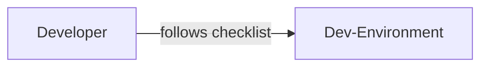
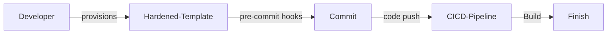
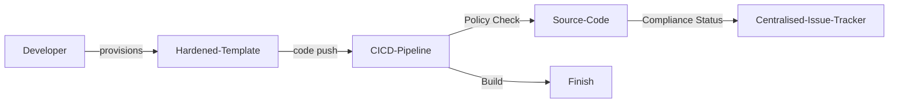

# セキュア開発環境 (Secure Development Environment)

| ID             |
| -------------- |
| DSOVS-CODE-001 |

## 概要

開発者はコードの完全性を確保し、ソースコード窃取のリスクを避けるために、セキュアな開発環境を使用することが重要です。

他のネットワークから隔離されたセキュアな環境を使用することで、開発者は自分のコードを安全かつセキュアに維持できます。

さらに、開発環境を監視および監査できるため、潜在的な脆弱性や悪意のある行為を特定するのに役立ちます。

これにより、開発者は許可なく自分のコードにアクセスする人がいないことを確認できるため、セキュリティがより高いレベルになります。

また、セキュアな開発環境を使用することで、コードがセキュアな場所に保存され、開発チーム以外の人はアクセスできないため、ソースコード窃取のリスクを軽減するのに役立ちます。

## レベル 0 - 開発環境のセキュリティ堅牢化標準がない

この成熟度のレベルでは、開発者のマシンや環境に対する定義済みセキュリティ堅牢化標準はありません。開発者は自身のラップトップ、ワークステーション、ローカルツールチェーンを各自の思い通りに設定しており、オペレーティングシステムの設定、ディスク暗号化、パッチ適用、アクセス制御に関する合意されたベースラインはありません。

各環境はそれぞれ異なる設定であり、文書化もされていないため、組織はソースコード、クレデンシャル、ビルドツールが適切に保護されているかどうかを知る術がありません。存在するセキュリティは偶発的であり、完全に個々の開発者に依存しています。

## レベル 1 - 開発環境の堅牢化標準またはセキュリティチェックリストがある

この段階では、組織は、開発環境の構成方法を定めた文書化された堅牢化標準やセキュリティチェックリストを作り出しています。これは一般的に、ディスク全体の暗号化、自動画面ロック、オペレーティングシステムや依存関係のパッチ適用、管理者権限の制限、ソースコードへのシークレットの保持回避といった項目をカバーします。

この標準はガイダンスとして存在し、手動で適用されます。開発者はチェックリストを読んで各自の環境を適切に設定することを求められ、準拠状況は自動的に強制されるのではなく必要に応じてレビューされます。遵守は依然として個人の取り組みに依存しますが、全員が基準にできる共有され、文書化されたベースラインがあるため、これはレベル 0 からの改善といえます。



## レベル 2 - 開発環境の堅牢化テンプレートを実装している

ここでは堅牢化標準は単に手作業で従う文書に限りません。それは再使用可能かつ事前設定済みのテンプレートとして実装されています。これは、管理されたゴールデンマシンイメージ、構成管理プロファイル (Ansible, Chef, MDM ポリシーなど)、または承認済みツールやセキュリティ設定が組み込まれた Dev Container のようなコンテナ化された開発環境といった形態が考えられます。

セキュアなベースラインはテンプレートとして提供されるため、すべての開発者が同じ堅牢化された状態から開始し、個人がチェックリストを覚えていることに依存するのではなく、一貫性があり繰り返し可能なようにコントロールが適用されます。オンボーディングが迅速になり、環境間の設定の乖離が大幅に低減されます。



## レベル 3 - 開発環境の堅牢化標準に沿ったセキュリティポリシーを適用している

At the highest level of maturity the hardening standards are actively enforced rather than merely provided. Policies are applied and continuously monitored through tooling such as MDM/endpoint management, policy-as-code, and pre-commit or CI checks, so that non-compliant environments are detected and either remediated automatically or blocked from interacting with source code and pipelines.

Compliance status is tracked centrally, giving the organisation visibility into which environments meet the baseline and which do not. The effectiveness of the hardening standards is reviewed periodically and the templates and policies are improved over time to keep pace with new threats, changes in tooling, and the organisation's risk appetite. This builds on Level 2 by closing the gap between having a hardened template and guaranteeing it is consistently in force.



# Notable Tools

⚠️ **Disclaimer**

Apart from official OWASP Projects, the tools in this section have been chosen on the basis of their proven capabilities alone and there is no other relationship between the DSOVS project leaders and the creators or vendors who maintain them. 

If you have a suggestion for a notable tool please [💡 Suggest a Tool](https://github.com/OWASP/www-project-devsecops-verification-standard/discussions/categories/ideas) 

## [pre-commit](https://github.com/pre-commit/pre-commit)

pre-commit is a framework for managing and maintaining multi-language Git pre-commit hooks. It lets you enforce hardening checks - such as detecting hardcoded secrets, blocking large or private-key files, and validating configuration - directly in the developer environment before code is ever committed. Running the same hooks both locally and in CI ensures the secure baseline is applied consistently across every developer's machine.

A typical `.pre-commit-config.yaml` defining a set of security and hygiene hooks:

```yaml
repos:
  - repo: https://github.com/pre-commit/pre-commit-hooks
    rev: v4.6.0
    hooks:
      - id: detect-private-key
      - id: check-added-large-files
      - id: end-of-file-fixer
      - id: trailing-whitespace
      - id: check-merge-conflict
  - repo: https://github.com/gitleaks/gitleaks
    rev: v8.18.4
    hooks:
      - id: gitleaks
```

Developers install the hooks once with `pre-commit install`, after which the checks run automatically on every commit.

<a href="https://github.com/pre-commit/action"> GitHub Actions</a>

```yaml
name: pre-commit

on:
  pull_request:
  push:
    branches: [main]

jobs:
  pre-commit:
    runs-on: ubuntu-latest
    steps:
      - uses: actions/checkout@v4
      - uses: actions/setup-python@v5
        with:
          python-version: "3.x"
      - uses: pre-commit/action@v3.0.1
```

## [Development Containers](https://github.com/devcontainers)

Development Containers (Dev Containers) let a project define its development environment as code in a `devcontainer.json` file. By describing the base image, tooling, extensions, and settings declaratively, every developer - and the CI pipeline - works from the same standardised, hardened environment, which directly supports the Level 2 "harden template" and Level 3 enforcement goals. Editors such as VS Code and platforms like GitHub Codespaces can build and open these containers automatically.

A minimal hardened `.devcontainer/devcontainer.json`:

```json
{
  "name": "secure-dev-environment",
  "image": "mcr.microsoft.com/devcontainers/base:ubuntu",
  "runArgs": ["--cap-drop=ALL", "--security-opt=no-new-privileges"],
  "remoteUser": "vscode",
  "features": {
    "ghcr.io/devcontainers/features/git:1": {}
  },
  "postCreateCommand": "pre-commit install"
}
```

## 参考情報

- https://owasp.org/www-project-devsecops-guideline/
- https://github.com/pre-commit/pre-commit
- https://containers.dev/
