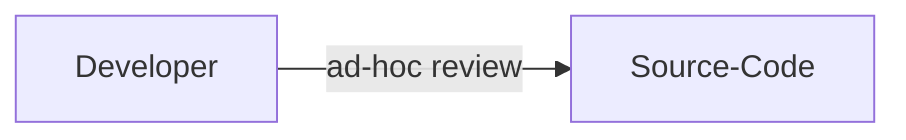
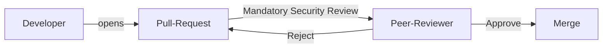
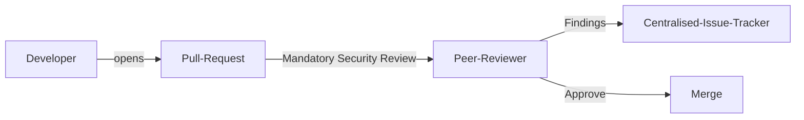

# 手動セキュアコードレビュー (Manual Secure Code Review)

| ID             |
| -------------- |
| DSOVS-CODE-003 |

## 概要

自動ソースコードレビューに加えて、手動ソースコードレビューはセキュアソフトウェア開発ライフサイクルの重要な部分です。

コードを手動でレビューすることにより、開発者は見落とされている可能性がある潜在的なセキュリティ脆弱性を特定できます。

これにより、あらゆる弱点が対処され、コードがセキュアであることを確保できます。

さらに、手動ソースコードレビューはソースコードに隠されたバックドアや悪意のあるコードが存在しないことを確認するのに役立ちます。

これは潜在的な攻撃からユーザーを保護し、ソフトウェアに対するユーザーの信頼を維持するのにも役立ちます。

手動ソースコードレビューはコードの不備やエラーを検出するのにも役立ちます。その結果、ソフトウェアをセキュアに維持するために迅速かつ効果的に対処できます。

## レベル 0 - セキュリティコーディング標準がない

At this level of maturity there is no manual secure code review taking place, and there are no security coding standards to guide developers. Code is written and merged based on functional correctness alone, with no documented expectations for how security concerns should be handled.

Without any shared standard or review step, security defects depend entirely on the individual knowledge of whoever happens to write the code. Common weaknesses such as injection flaws, broken access control, or insecure handling of secrets can pass into production unnoticed because no one is specifically looking for them.

## レベル 1 - セキュリティチェックリストがコーディング標準の一部となっている

At level one the organisation has begun to formalise its expectations by including a security checklist as part of its coding standards. The checklist captures the security concerns that reviewers and authors should keep in mind, such as input validation, output encoding, authentication and authorisation checks, error handling, and the safe use of cryptography and secrets.

Manual secure code review at this stage is typically ad-hoc. Developers may consult the checklist and perform a review when they remember to or when a change feels risky, but it is not yet a required step in the workflow. The improvement over level zero is that there is now a documented, shared reference describing what a secure review should cover, even if its application is inconsistent.

## レベル 2 - セキュリティコーディング標準をピアレビューに使用している

At level two, manual secure code review becomes a required part of the development workflow rather than an optional activity. The security checklist and coding standards are actively used during peer review, most commonly as a mandatory step on every pull request before code can be merged.

Reviewers are expected to work through the checklist and confirm that the relevant security concerns have been addressed, and the review is recorded as part of the merge process. This consistency is the key improvement over level one: instead of depending on whether an individual developer chooses to review for security, every change is examined against the same standard by a second person before it reaches the main branch.

## レベル 3 - 定期的なレビュースケジュールを定め、セキュリティコーディング標準をレビューしている

At level three the practice is centrally tracked, measured, and continuously improved. Review activity and outcomes are captured so the organisation can report on coverage, such as the proportion of changes that received a security review, and on effectiveness, such as the types of issues found, missed, or repeated across teams.

A defined periodic review schedule ensures the security coding standard and its checklist do not become stale. The standard is revisited on a regular cadence and updated to reflect new threats, lessons learned from incidents and findings, changes in technology, and feedback from reviewers. The improvement over level two is that the review process itself is treated as a measurable control that is monitored and refined over time, rather than a fixed checklist applied indefinitely.

## Further reading
- [OWASP Code Review Guide](https://owasp.org/www-project-code-review-guide/) - a comprehensive guide to performing manual secure code reviews and building a review process.
- [OWASP SAMM - Design: Security Architecture](https://owaspsamm.org/model/design/security-architecture/) - guidance on establishing and reinforcing secure design and coding expectations.
- [OWASP SAMM - Implementation: Secure Build](https://owaspsamm.org/model/implementation/secure-build/) - how review and standards fit into a repeatable, controlled build and delivery workflow.
- [OWASP Application Security Verification Standard (ASVS)](https://owasp.org/www-project-application-security-verification-standard/) - a catalogue of security requirements that can form the basis of a secure code review checklist.
- [OWASP Cheat Sheet Series](https://cheatsheetseries.owasp.org/) - practical, topic-specific guidance useful when defining checklist items for common vulnerability classes.
