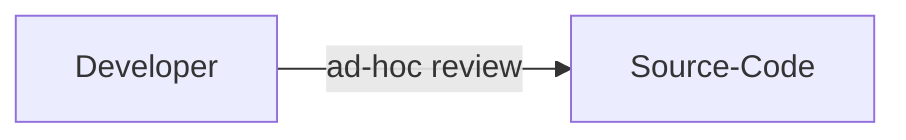
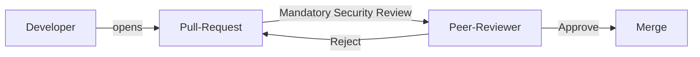
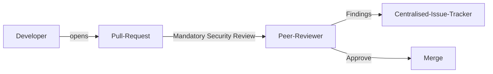

# 手動セキュアコードレビュー (Manual Secure Code Review)

| ID             |
| -------------- |
| DSOVS-CODE-003 |

## 概要

自動ソースコードレビューに加えて、手動ソースコードレビューはセキュアソフトウェア開発ライフサイクルの重要な部分です。

コードを手動でレビューすることにより、開発者は見落とされている可能性がある潜在的なセキュリティ脆弱性を特定できます。

これにより、あらゆる弱点が対処され、コードがセキュアであることを確保できます。

さらに、手動ソースコードレビューはソースコードに隠されたバックドアや悪意のあるコードが存在しないことを確認するのに役立ちます。

これは潜在的な攻撃からユーザーを保護し、ソフトウェアに対するユーザーの信頼を維持するのにも役立ちます。

手動ソースコードレビューはコードの不備やエラーを検出するのにも役立ちます。その結果、ソフトウェアをセキュアに維持するために迅速かつ効果的に対処できます。

## レベル 0 - セキュリティコーディング標準がない

この成熟度のレベルでは、手動のセキュアコードレビューがなく、開発者をガイドするセキュリティコーディング標準もありません。コードは機能的な正しさのみに基づいて記述およびマージされており、セキュリティ上の懸念がどのように対処されるべきかについての明文化された要求もありません。

共通の基準やレビューステップなしでは、セキュリティ上の欠陥は、たまたまそのコードを書いた人物の個々の知識に完全に依存します。インジェクションの欠陥、不備のあるアクセス制御、シークレットの安全でない取り扱いのようなよくある弱点は、それらを特に確認する者がいないため、気付かれないまま製品に組み込まれる恐れがあります。

## レベル 1 - セキュリティチェックリストがコーディング標準の一部となっている

レベル 1 では、組織はコーディング標準の一部としてセキュリティチェックリストを含むことで、その要求を形式化し始めています。チェックリストは、入力バリデーション、出力エンコーディング、認証と認可のチェック、エラー処理、暗号技術とシークレットの安全な使用など、レビュー担当者と作成者が留意すべきセキュリティ上の懸念事項を捕捉しています。

この段階での手動のセキュアコードレビューは一般的に場当たり的です。開発者は、思い出した時や変更にリスクを感じたときに、チェックリストを参照してレビューを実行することがありますが、ワークフローにおいて必須のステップにはなっていません。レベル 0 からの改善点は、セキュアレビューがカバーすべきことを記述した、文書化され共有された参照情報があることです (たとえ、その適用に一貫性がないとしても)。

```mermaid
graph LR; Developer-- ad-hoc review -->Source-Code;
```

## レベル 2 - セキュリティコーディング標準をピアレビューに使用している

レベル 2 では、手動のセキュアコードレビューは任意の活動ではなく、開発ワークフローの必須工程となります。セキュリティチェックリストやコーディング標準はピアレビューの際に積極的に使用され、最も一般的には、コードがマージされる前のすべてのプルリクエストでの必須のステップとなります。

レビュー担当者はチェックリストに沿って作業を行い、関連するセキュリティ上の懸念が対処されていることを確認し、そのレビューがマージプロセスの一環として記録されることが期待されます。この一貫性はレベル 1 からの重要な改善点です。個々の開発者がセキュリティのレビューを選択するかどうかに委ねるのではなく、すべての変更がメインブランチに到達する前に、別の人物によって同一の標準で実行されます。

```mermaid
graph LR;
Developer-- opens -->Pull-Request-- Mandatory Security Review -->Peer-Reviewer--Approve -->Merge; Peer-Reviewer-- Reject -->Pull-Request
```

## レベル 3 - 定期的なレビュースケジュールを定め、セキュリティコーディング標準をレビューしている

レベル 3 では、そのプラクティスが一元的に追跡され、測定され、継続的に改善されます。レビュー活動や結果が捕捉されるため、組織は、セキュリティレビューを受けた変更の割合といった網羅率や、発見された問題、見落とされた問題、チーム間で繰り返される問題の種類といった有効性について報告できます。

定期的なレビュースケジュールを定義して、セキュリティコーディング標準やそのチェックリストが古くならないようにします。この標準は定期的に見直され、新たな脅威、インシデントや調査から得られた教訓、技術の変化、レビュー担当者からのフィードバックを反映して更新されます。レベル 2 からの改善点は、レビュープロセス自体が、固定されたチェックリストを永続的に適用するのではなく、経時的に監視および洗練される測定可能なコントロールとして扱われることです。

```mermaid
graph LR;
Developer-- opens -->Pull-Request-- Mandatory Security Review -->Peer-Reviewer--Findings -->Centralised-Issue-Tracker; Peer-Reviewer-- Approve -->Merge
```

## 参考情報
- [OWASP Code Review Guide](https://owasp.org/www-project-code-review-guide/) - a comprehensive guide to performing manual secure code reviews and building a review process.
- [OWASP SAMM - Design: Security Architecture](https://owaspsamm.org/model/design/security-architecture/) - guidance on establishing and reinforcing secure design and coding expectations.
- [OWASP SAMM - Implementation: Secure Build](https://owaspsamm.org/model/implementation/secure-build/) - how review and standards fit into a repeatable, controlled build and delivery workflow.
- [OWASP Application Security Verification Standard (ASVS)](https://owasp.org/www-project-application-security-verification-standard/) - a catalogue of security requirements that can form the basis of a secure code review checklist.
- [OWASP Cheat Sheet Series](https://cheatsheetseries.owasp.org/) - practical, topic-specific guidance useful when defining checklist items for common vulnerability classes.
