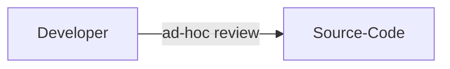
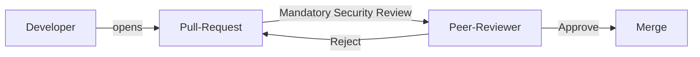
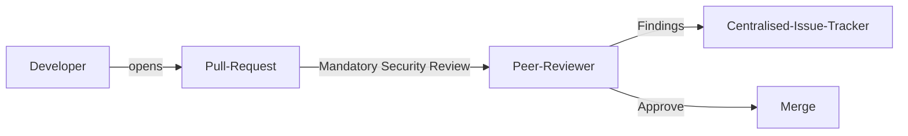

# 手動セキュアコードレビュー (Manual Secure Code Review)

| ID             |
| -------------- |
| DSOVS-CODE-003 |

## 概要

自動ソースコードレビューに加えて、手動ソースコードレビューはセキュアソフトウェア開発ライフサイクルの重要な部分です。

コードを手動でレビューすることにより、開発者は見落とされている可能性がある潜在的なセキュリティ脆弱性を特定できます。

これにより、あらゆる弱点が対処され、コードがセキュアであることを確保できます。

さらに、手動ソースコードレビューはソースコードに隠されたバックドアや悪意のあるコードが存在しないことを確認するのに役立ちます。

これは潜在的な攻撃からユーザーを保護し、ソフトウェアに対するユーザーの信頼を維持するのにも役立ちます。

手動ソースコードレビューはコードの不備やエラーを検出するのにも役立ちます。その結果、ソフトウェアをセキュアに維持するために迅速かつ効果的に対処できます。

## レベル 0 - セキュリティコーディング標準がない

この成熟度のレベルでは、手動のセキュアコードレビューがなく、開発者をガイドするセキュリティコーディング標準もありません。コードは機能的な正しさのみに基づいて記述およびマージされており、セキュリティ上の懸念がどのように対処されるべきかについての明文化された要求もありません。

共通の基準やレビューステップなしでは、セキュリティ上の欠陥は、たまたまそのコードを書いた人物の個々の知識に完全に依存します。インジェクションの欠陥、不備のあるアクセス制御、シークレットの安全でない取り扱いのようなよくある弱点は、それらを特に確認する者がいないため、気付かれないまま製品に組み込まれる恐れがあります。

## レベル 1 - セキュリティチェックリストがコーディング標準の一部となっている

レベル 1 では、組織はコーディング標準の一部としてセキュリティチェックリストを含むことで、その要求を形式化し始めています。チェックリストは、入力バリデーション、出力エンコーディング、認証と認可のチェック、エラー処理、暗号技術とシークレットの安全な使用など、レビュー担当者と作成者が留意すべきセキュリティ上の懸念事項を捕捉しています。

この段階での手動のセキュアコードレビューは一般的に場当たり的です。開発者は、思い出した時や変更にリスクを感じたときに、チェックリストを参照してレビューを実行することがありますが、ワークフローにおいて必須のステップにはなっていません。レベル 0 からの改善点は、セキュアレビューがカバーすべきことを記述した、文書化され共有された参照情報があることです (たとえ、その適用に一貫性がないとしても)。

```mermaid
graph LR; Developer-- ad-hoc review -->Source-Code;
```

## レベル 2 - セキュリティコーディング標準をピアレビューに使用している

At level two, manual secure code review becomes a required part of the development workflow rather than an optional activity. The security checklist and coding standards are actively used during peer review, most commonly as a mandatory step on every pull request before code can be merged.

Reviewers are expected to work through the checklist and confirm that the relevant security concerns have been addressed, and the review is recorded as part of the merge process. This consistency is the key improvement over level one: instead of depending on whether an individual developer chooses to review for security, every change is examined against the same standard by a second person before it reaches the main branch.

```mermaid
graph LR;
Developer-- opens -->Pull-Request-- Mandatory Security Review -->Peer-Reviewer--Approve -->Merge; Peer-Reviewer-- Reject -->Pull-Request
```

## レベル 3 - 定期的なレビュースケジュールを定め、セキュリティコーディング標準をレビューしている

At level three the practice is centrally tracked, measured, and continuously improved. Review activity and outcomes are captured so the organisation can report on coverage, such as the proportion of changes that received a security review, and on effectiveness, such as the types of issues found, missed, or repeated across teams.

A defined periodic review schedule ensures the security coding standard and its checklist do not become stale. The standard is revisited on a regular cadence and updated to reflect new threats, lessons learned from incidents and findings, changes in technology, and feedback from reviewers. The improvement over level two is that the review process itself is treated as a measurable control that is monitored and refined over time, rather than a fixed checklist applied indefinitely.

```mermaid
graph LR;
Developer-- opens -->Pull-Request-- Mandatory Security Review -->Peer-Reviewer--Findings -->Centralised-Issue-Tracker; Peer-Reviewer-- Approve -->Merge
```

## 参考情報
- [OWASP Code Review Guide](https://owasp.org/www-project-code-review-guide/) - a comprehensive guide to performing manual secure code reviews and building a review process.
- [OWASP SAMM - Design: Security Architecture](https://owaspsamm.org/model/design/security-architecture/) - guidance on establishing and reinforcing secure design and coding expectations.
- [OWASP SAMM - Implementation: Secure Build](https://owaspsamm.org/model/implementation/secure-build/) - how review and standards fit into a repeatable, controlled build and delivery workflow.
- [OWASP Application Security Verification Standard (ASVS)](https://owasp.org/www-project-application-security-verification-standard/) - a catalogue of security requirements that can form the basis of a secure code review checklist.
- [OWASP Cheat Sheet Series](https://cheatsheetseries.owasp.org/) - practical, topic-specific guidance useful when defining checklist items for common vulnerability classes.
