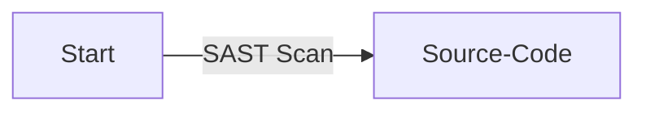
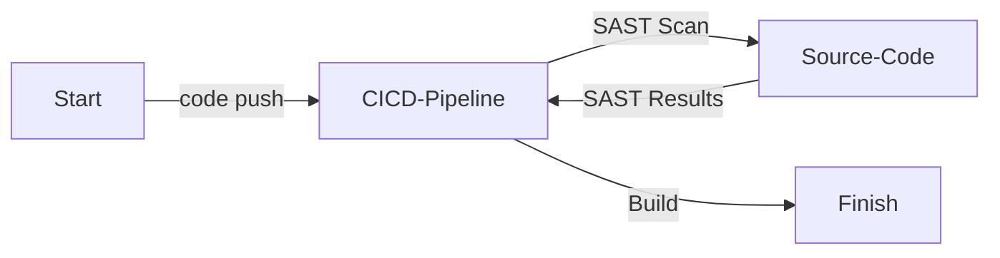
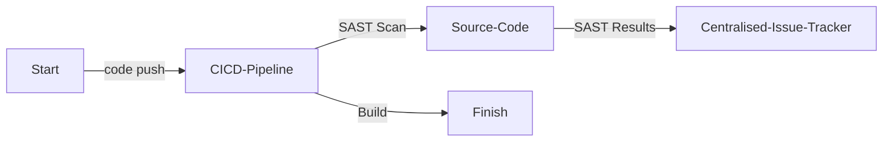

# 静的アプリケーションセキュリティテスト (Static Application Security Testing, SAST)

| ID             |
| -------------- |
| DSOVS-CODE-004 |

## 概要

静的アプリケーションセキュリティテスト (Static Application Security Testing, SAST) は静的コード解析とも呼ばれ、アプリケーションのソースコードのセキュリティ脆弱性を探す自動セキュリティテストの一種です。

これは開発プロセスの潜在的なセキュリティ問題を早期に検出できるため、DevSecOps の重要な部分となっています。

ソースコードの脆弱性を明らかにすることで、開発者はアプリケーションがデプロイされる前にセキュアであることを確認できます。

さらに、SAST は開発時に見落とされていた可能性のあるコーディングエラーや不備を特定し、アプリケーションが期待通りに動作することを確保するのに役立ちます。

これにより、コードを手動でチェックするのに必要な時間と労力を削減し、アプリケーションが稼働する前にセキュリティ問題が対処されていることを確認できます。

## レベル 0 - 静的コードセキュリティ解析を実施するためのツールがない

At this level of security maturity, there are no tools available to perform Static Application Security Testing (SAST). Source code is written and shipped without any automated analysis of its security properties, so any vulnerabilities introduced during development remain undetected until they are found in later testing phases or, worse, in production.

## レベル 1 - オンデマンドスキャンを実行するツールを使用し、セキュアでないコードを特定している

At this stage, a SAST tool is present but the scanning is performed on a case-by-case basis. A developer or security engineer runs the analyser manually against the source code when they choose to, rather than on a defined schedule or trigger. Because the process is not automated, scans are easily forgotten between releases and the results may not be reported or recorded in any consistent way.



## レベル 2 - ビルドパイプラインにセキュリティ静的コード解析のスキャンツールを実装し、自動スキャンを実行し、ビルドのステータスをレポートしている

Here, SAST scanning is implemented into the software build pipeline. This means that whenever a build is executed, an automated static analysis of the source code is triggered and the results are reported back to the build. Developers receive consistent, repeatable feedback on insecure code with every push, and the pipeline can be configured to fail or flag a build when issues of a given severity are detected.



## レベル 3 - 発見された内容が自動的に一元管理された課題追跡システムに記録されており、ツールの有効性を定期的にレビューしている

Level 3 of SAST is the same as level 2, with the addition of all identified security vulnerabilities being recorded in a centralised issue tracking system and periodically reviewed to evaluate the effectiveness of the SAST tool. The same automated scans run on every build, but the results are now collected, tracked and analysed over time so that findings can be triaged, assigned and remediated through an established workflow.

Reviewing the tool's effectiveness also allows teams to tune rule sets, suppress false positives and confirm that the analyser is keeping pace with the languages and frameworks in use. More mature organisations often provide teams with shared CI/CD templates and baseline configurations, making consistent SAST adoption across the organisation considerably easier.



# Notable Tools

⚠️ **Disclaimer**

Apart from official OWASP Projects, the tools in this section have been chosen on the basis of their proven capabilities alone and there is no other relationship between the DSOVS project leaders and the creators or vendors who maintain them. 

If you have a suggestion for a notable tool please [💡 Suggest a Tool](https://github.com/OWASP/www-project-devsecops-verification-standard/discussions/categories/ideas) 

## [Semgrep](https://github.com/semgrep/semgrep)

Semgrep is a fast, open-source static analysis engine for finding bugs, detecting vulnerabilities and enforcing code standards. It supports more than 30 languages and uses an intuitive, pattern-based rule syntax that closely resembles the source code being scanned, making it straightforward to write custom rules alongside the large community rule registry.

<a href="https://semgrep.dev/docs/semgrep-ci/sample-ci-configs"> GitHub Actions

```
name: Semgrep
on:
  pull_request: {}
  push:
    branches: [main, master]
  schedule:
    - cron: '0 0 * * 0' # weekly full scan

jobs:
  semgrep:
    name: semgrep/ci
    runs-on: ubuntu-latest
    container:
      image: semgrep/semgrep
    steps:
      - uses: actions/checkout@v4
      - run: semgrep ci
        env:
          SEMGREP_APP_TOKEN: ${{ secrets.SEMGREP_APP_TOKEN }}
```

<a href="https://semgrep.dev/docs/semgrep-ci/sample-ci-configs"> GitLab CI

```
stages:
  - test

semgrep:
  stage: test
  image: semgrep/semgrep
  script:
    - semgrep ci --gitlab-sast > gl-sast-report.json || true
  variables:
    SEMGREP_APP_TOKEN: $SEMGREP_APP_TOKEN
  artifacts:
    reports:
      sast: gl-sast-report.json
  rules:
    - if: $CI_PIPELINE_SOURCE == "merge_request_event"
    - if: $CI_COMMIT_BRANCH == $CI_DEFAULT_BRANCH
```

## [CodeQL](https://github.com/github/codeql-action)

CodeQL is GitHub's semantic code analysis engine. It treats code as data, building a queryable database from a codebase so that security researchers and developers can express vulnerability patterns as declarative queries. CodeQL ships with an extensive library of security queries and integrates natively with GitHub's code scanning to surface results directly in pull requests.

<a href="https://docs.github.com/en/code-security/code-scanning/integrating-with-code-scanning/sarif-support-for-code-scanning"> GitHub Actions

```
name: CodeQL
on:
  push:
    branches: [main]
  pull_request:
    branches: [main]
  schedule:
    - cron: '0 3 * * 1'

jobs:
  analyze:
    name: Analyze
    runs-on: ubuntu-latest
    permissions:
      security-events: write
      actions: read
      contents: read
    strategy:
      matrix:
        language: ['javascript', 'python']
    steps:
      - uses: actions/checkout@v4
      - name: Initialize CodeQL
        uses: github/codeql-action/init@v3
        with:
          languages: ${{ matrix.language }}
      - name: Autobuild
        uses: github/codeql-action/autobuild@v3
      - name: Perform CodeQL Analysis
        uses: github/codeql-action/analyze@v3
```

<a href="https://docs.github.com/en/code-security/code-scanning/integrating-with-code-scanning/sarif-support-for-code-scanning"> GitLab CI

```
stages:
  - test

codeql:
  stage: test
  image:
    name: mcr.microsoft.com/cstsectools/codeql-container:latest
    entrypoint: [""]
  script:
    - codeql database create codeql-db --language=javascript --source-root .
    - codeql database analyze codeql-db --format=sarif-latest --output=codeql-results.sarif
  artifacts:
    paths:
      - codeql-results.sarif
```
