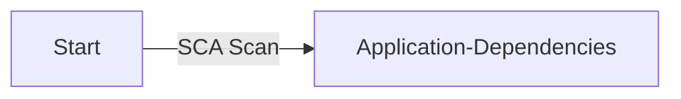
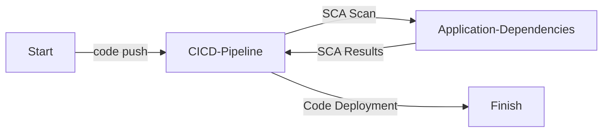
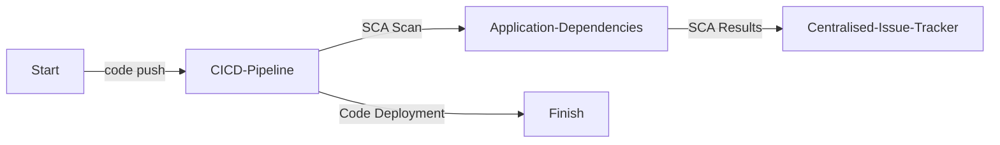

# ソフトウェアコンポジション解析 (Software Composition Analysis, SCA)

| ID             |
| -------------- |
| DSOVS-CODE-005 |

## 概要

ソースコンポジション解析 (Source Composition Analysis, SCA) はソースコードをスキャンし、アプリケーションで使用されているライブラリ、依存関係、およびその他のサードパーティコンポーネントを特定するセキュリティテクノロジです。

アプリケーションのすべてのコンポーネントがセキュアかつ最新であることを保証するのに役立つため、DevSecOps の重要な部分となっています。

既知の脆弱性や古いバージョンのコードを検出することで、サードパーティコンポーネントが使用されている場合でも、SCA はアプリケーションがセキュアであり続けることを確保するのに役立ちます。

さらに、SCA は開発者に新しいバージョンのコードを知らせることができるため、開発者はそれに応じてアプリケーションを更新できます。

これにより最新のセキュリティパッチやアップデートが確実に適用され、アプリケーションのセキュリティをさらに向上できます。

## レベル 0 - サードパーティ依存関係解析を実施するためのツールがない

At this level of security maturity, there are no tools available to perform software composition analysis. The open-source and third-party components an application depends on are not inventoried, and there is no visibility into the known vulnerabilities or licensing obligations that those components introduce.

## レベル 1 - オンデマンドスキャンを実行するツールを使用し、アプリケーションで使用されている古いまたはセキュアでないサードパーティコンポーネントを特定している

At this stage, an SCA tool is present but the scanning is performed on a case-by-case basis. A developer or security engineer runs the tool manually against a project to enumerate its dependencies and check them against vulnerability and license databases. Because these scans are run ad hoc rather than on a schedule or trigger, they are easily forgotten, and the results may not be reported or recorded in a consistent way.



## レベル 2 - ビルドパイプラインにサードパーティコンポーネント脆弱性のスキャンツールを実装し、自動スキャンを実行し、ビルドのステータスをレポートしている

Here, SCA scanning is implemented into the software build pipeline. Whenever a build is executed, the tool automatically resolves the application's dependency tree, generates a software bill of materials (SBOM), and checks each component against known vulnerability and license data, reporting the status back to the build. This ensures that every change is consistently evaluated for vulnerable or non-compliant third-party components before it progresses, and the pipeline can be configured to fail the build when high-severity issues are detected.



## レベル 3 - 発見された内容が自動的に一元管理された課題追跡システムに記録されており、ツールの有効性を定期的にレビューしている

Level 3 of SCA is the same as level 2, with the addition of all identified vulnerabilities and license violations being recorded automatically in a centralised issue tracking system and periodically reviewed to evaluate the effectiveness of the SCA tool. The same automated scans are performed on every build, but the results are now collected, tracked, and analysed over time, allowing teams to monitor remediation progress, measure dependency risk across the organisation, and tune the tool's configuration to reduce noise and false positives.

At this level, more mature organisations also provide teams with simplified adoption guidance, such as shared CI/CD templates, organisation-wide policy on acceptable licenses and severity thresholds, and managed allow-lists for known false positives, making consistent SCA coverage easier to achieve across many repositories.



# Notable Tools

⚠️ **Disclaimer**

Apart from official OWASP Projects, the tools in this section have been chosen on the basis of their proven capabilities alone and there is no other relationship between the DSOVS project leaders and the creators or vendors who maintain them. 

If you have a suggestion for a notable tool please [💡 Suggest a Tool](https://github.com/OWASP/www-project-devsecops-verification-standard/discussions/categories/ideas) 

## [OWASP Dependency-Check](https://github.com/jeremylong/DependencyCheck)

OWASP Dependency-Check is a software composition analysis tool that identifies project dependencies and checks whether there are any known, publicly disclosed vulnerabilities. It does this by determining a Common Platform Enumeration (CPE) identifier for each dependency and, if found, generating a report linking to the associated Common Vulnerabilities and Exposures (CVE) entries. It supports a wide range of ecosystems and integrates easily into build pipelines.

<a href="https://github.com/dependency-check/Dependency-Check_Action"> GitHub Actions</a>

```
name: Dependency-Check
on:
  push:
  pull_request:
  schedule:
    - cron: '0 4 * * *' # run once a day at 4 AM

permissions:
  contents: read

jobs:
  dependency-check:
    runs-on: ubuntu-latest
    name: Software Composition Analysis
    steps:
      - name: Checkout
        uses: actions/checkout@v4

      - name: Run Dependency-Check
        uses: dependency-check/Dependency-Check_Action@main
        with:
          project: 'my-application'
          path: '.'
          format: 'SARIF'
          out: 'reports'

      - name: Upload results to Security Dashboard
        uses: github/codeql-action/upload-sarif@v3
        with:
          sarif_file: reports/dependency-check-report.sarif
```

<a href="https://jeremylong.github.io/DependencyCheck/dependency-check-cli/index.html"> GitLab CI</a>

```
stages:
  - composition-analysis

dependency-check:
  stage: composition-analysis
  image:
    name: owasp/dependency-check:latest
    entrypoint: [""]
  script:
    - /usr/share/dependency-check/bin/dependency-check.sh
        --project "$CI_PROJECT_NAME"
        --scan .
        --format "ALL"
        --out reports
  artifacts:
    paths:
      - reports/
```

## [Trivy](https://github.com/aquasecurity/trivy)

Trivy is an open-source, all-in-one security scanner that finds vulnerabilities and license issues across application dependencies, container images, filesystems, and infrastructure-as-code. For software composition analysis it parses lockfiles and manifests to build a complete picture of an application's third-party components, can emit an SBOM in CycloneDX or SPDX format, and reports any known vulnerabilities affecting them.

<a href="https://github.com/aquasecurity/trivy-action"> GitHub Actions</a>

```
name: Trivy SCA
on:
  push:
  pull_request:

permissions:
  contents: read
  security-events: write

jobs:
  trivy-scan:
    runs-on: ubuntu-latest
    name: Scan dependencies
    steps:
      - name: Checkout
        uses: actions/checkout@v4

      - name: Run Trivy filesystem scan
        uses: aquasecurity/trivy-action@master
        with:
          scan-type: 'fs'
          scan-ref: '.'
          scanners: 'vuln,license'
          format: 'sarif'
          output: 'trivy-results.sarif'

      - name: Upload Trivy results to Security Dashboard
        uses: github/codeql-action/upload-sarif@v3
        with:
          sarif_file: 'trivy-results.sarif'
```

<a href="https://trivy.dev/latest/tutorials/integrations/gitlab-ci/"> GitLab CI</a>

```
stages:
  - composition-analysis

trivy:
  stage: composition-analysis
  image:
    name: aquasec/trivy:latest
    entrypoint: [""]
  script:
    - trivy fs --scanners vuln,license --format json --output gl-sca-report.json .
  artifacts:
    paths:
      - gl-sca-report.json
```
