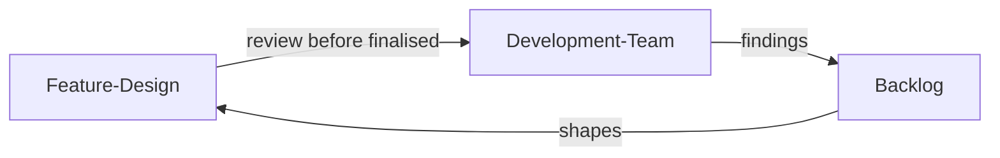
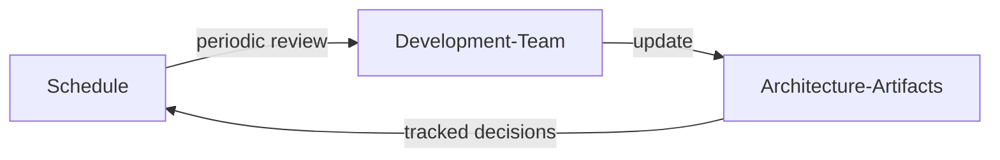

# セキュリティアーキテクチャ設計レビュー (Security Architecture Design Reviews)

| ID            |
| ------------- |
| DSOVS-DES-001 |

## 概要

セキュアアーキテクチャ設計レビューはセキュアアーキテクチャの開発に焦点を当てたセキュリティレビューの一種です。

ソフトウェアシステムのアーキテクチャと設計を分析して、組織のセキュリティ目標と目的を満たしていることを確認します。

システムの弱点や潜在的な脆弱性を特定するのに役立ち、チームはシステムのセキュリティ態勢を改善するための是正措置を講じることができるため、これらのレビューは DevSecOps では重要です。

セキュアアーキテクチャ設計レビューはシステムがセキュリティのベストプラクティスや業界標準を遵守していることを確認するのにも役立ちます。

## レベル 0 - セキュリティアーキテクチャ設計レビューを実施していない

At this level there is no practice of reviewing architecture or design from a security perspective. Systems are built and changed without anyone deliberately examining how their structure, trust boundaries, data flows, or integration points might introduce risk.

Because security is never considered at the design stage, weaknesses tend to surface much later, during testing, audits, or after an incident, where they are far more expensive and disruptive to fix. The organisation has no shared understanding of the security assumptions underpinning its systems.

## レベル 1 - セキュリティアーキテクチャ設計レビューをアドホックに実施し、開発チームのバックログにアクションアイテムを作成している

At level one, security architecture design reviews begin to happen, but on an informal and reactive basis. Typically a security analyst is pulled in to look over a particular design when someone remembers to ask, or when a change feels high risk. The review examines the proposed architecture, identifies areas of concern, and records the resulting recommendations as action items in the development team's backlog so they are not lost.

This is a meaningful improvement over having no reviews at all, because at least some designs now receive security scrutiny and the findings are captured in a place the team already works from. However, coverage depends entirely on individuals choosing to initiate a review, so it remains inconsistent and many changes still ship without ever being examined.

## レベル 2 - 開発アクティビティを確定する前にセキュリティアーキテクチャ設計レビューを実施し、開発チームのバックログにアクションアイテムを作成している

At level two, design review is no longer an occasional favour from a security analyst but a standard, expected activity that development teams perform themselves as part of building a feature. Reviews take place before the design is finalised and development is committed, so that security concerns can shape the architecture while changing it is still cheap. As with the previous level, the resulting action items are recorded in the team's backlog and tracked through to resolution.

The key advance is that responsibility shifts onto the teams who own the work and is built into the normal flow of delivery, rather than relying on a central specialist being available. This makes coverage far more consistent and timely, catches issues earlier in the lifecycle, and helps developers internalise secure design thinking as a routine part of their craft.

## レベル 3 - すべてのセキュリティ機能を設計で対処している

At level three, design review is governed by a periodic review schedule that keeps architecture and design artifacts current as systems evolve. Rather than reviewing only at the point a feature is first designed, the organisation revisits its designs on a defined cadence to confirm that every relevant security feature, control, and trust assumption is still addressed and still accurate. Design decisions, along with the rationale behind them, are documented and tracked over time so that the reasoning remains visible and auditable.

This represents a mature, measured practice in which the security architecture is treated as a living asset rather than a one-time deliverable. Because artifacts are kept up to date and decisions are traceable, drift between the documented design and the running system is caught early, new threats can be reflected back into existing designs, and the organisation can continuously demonstrate that its systems meet their intended security objectives.

## Further reading

- [OWASP SAMM - Design: Security Architecture](https://owaspsamm.org/model/design/security-architecture/) - the SAMM practice that defines maturity for designing software with secure architecture in mind, useful for benchmarking and planning improvements.
- [OWASP Application Security Verification Standard (ASVS) - V1 Architecture, Design and Threat Modeling](https://owasp.org/www-project-application-security-verification-standard/) - a set of verifiable requirements that give design reviews concrete criteria to check architectures against.
- [NIST SP 800-218 Secure Software Development Framework (SSDF)](https://csrc.nist.gov/projects/ssdf) - guidance whose "Protect the Software" and design-time practices map closely to reviewing architecture for security.
- [OWASP Security Architecture Cheat Sheet](https://cheatsheetseries.owasp.org/cheatsheets/Secure_Product_Design_Cheat_Sheet.html) - practical guidance and patterns to apply when conducting and acting on architecture design reviews.
- [OWASP Security by Design Principles](https://owasp.org/www-project-developer-guide/draft/design/web_app_checklist/define_security_requirements/) - foundational principles such as least privilege and defence in depth that reviewers use to evaluate a design.
