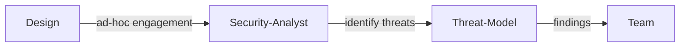
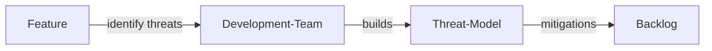
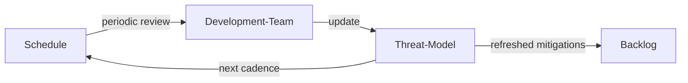

# 脅威モデリング (Threat Modelling)

| ID            |
| ------------- |
| DSOVS-DES-002 |

## 概要

脅威モデリングはアプリケーションのセキュリティに影響を与える可能性のある脅威をデプロイ前に分析するプロセスです。

これは潜在的なリスク、アプリケーションを保護するために必要なセキュリティコントロール、実施すべき緩和戦略を特定するのに役立ちます。

開発プロセス全体を通じてセキュリティへの配慮がなされ、組織が最初からセキュアな方法でアプリケーションを構築し、悪用のリスクを最小限に抑えることができるため、脅威モデリングは DevSecOps の重要な部分です。

## レベル 0 - 脅威モデリング作業を実施していない

At this level the organisation never deliberately reasons about how an application might be attacked. There is no exercise to enumerate assets, trust boundaries, entry points, or the threats an adversary could use against them.

Without threat modelling, security controls are chosen reactively or by habit rather than in response to a structured understanding of risk. Whole classes of threat can go unconsidered until they are discovered in production or exploited by an attacker, when remediation is slowest and most costly.

## レベル 1 - セキュリティアナリストによって脅威モデリングをアドホックに実施している

At level one, threat modelling starts to take place, but informally and only when a security analyst is engaged to do it. The analyst examines a design, identifies plausible threats and the controls needed to address them, and shares the findings with the team, typically for a system or change that is felt to be especially sensitive.

This is a clear step forward from never modelling threats at all, because at least some applications now benefit from a deliberate, structured look at how they could be attacked. The limitation is that the practice depends on a specialist's availability and on someone remembering to ask, so it is applied unevenly and many features are still built with no threat analysis behind them.

## レベル 2 - 開発チームによって機能ごとに脅威モデリングを実施している

At level two, threat modelling becomes part of the normal development flow and is carried out by the development teams themselves as they build features, rather than being outsourced to a security analyst. As a feature is designed, the team works through what could go wrong, what an attacker might target, and which mitigations belong in the design, capturing the resulting actions alongside their other work.

The important advance is one of ownership and scale: because the teams who understand the feature best perform the analysis as a routine activity, far more of the product gets modelled, threats are identified while the design can still be changed cheaply, and developers steadily build an instinct for thinking like an attacker. Security specialists can then focus on coaching and on the highest-risk areas rather than being a bottleneck.

## レベル 3 - 定期的なレビュースケジュールを定め、脅威モデリング成果物を最新に保っている

At level three, threat models are treated as living artifacts maintained on a defined, periodic review schedule. Rather than being produced once when a feature is first built and then forgotten, models are revisited on a regular cadence and whenever the system changes meaningfully, so that assets, trust boundaries, threats, and mitigations stay aligned with the application as it actually exists.

This is a mature, measured practice in which threat modelling continuously informs the organisation's security posture. Keeping the artifacts current means newly emerging threats can be reflected back into existing designs, controls can be verified as still appropriate, and the organisation retains an accurate, auditable picture of the risks facing each system over its whole lifetime.

# Notable Tools

⚠️ **Disclaimer**

Apart from official OWASP Projects, the tools in this section have been chosen on the basis of their proven capabilities alone and there is no other relationship between the DSOVS project leaders and the creators or vendors who maintain them. 

If you have a suggestion for a notable tool please [💡 Suggest a Tool](https://github.com/OWASP/www-project-devsecops-verification-standard/discussions/categories/ideas) 

## [OWASP Threat Dragon](https://github.com/OWASP/threat-dragon)

Threat Dragon is an OWASP project providing a free, open-source threat modelling tool. It lets teams draw data-flow diagrams, identify threats against the elements in them, and record mitigations, with the model stored as a versionable file so it can live alongside the code it describes.

## [pytm](https://github.com/izar/pytm)

pytm is a Pythonic framework for threat modelling as code. The system, its boundaries, and its dataflows are described in Python, and pytm generates data-flow diagrams, sequence diagrams, and a report of applicable threats, which makes threat models easy to keep under version control and to update as the design evolves.

## Further reading

- [OWASP Threat Modeling Cheat Sheet](https://cheatsheetseries.owasp.org/cheatsheets/Threat_Modeling_Cheat_Sheet.html) - a concise, practical guide to running a threat modelling exercise and what good output looks like.
- [OWASP SAMM - Design: Threat Assessment](https://owaspsamm.org/model/design/threat-assessment/) - the SAMM practice describing maturity levels for threat assessment, useful for measuring and planning improvement.
- [Microsoft STRIDE threat model](https://learn.microsoft.com/en-us/azure/security/develop/threat-modeling-tool-threats) - the widely used STRIDE methodology for categorising threats (Spoofing, Tampering, Repudiation, Information disclosure, Denial of service, Elevation of privilege).
