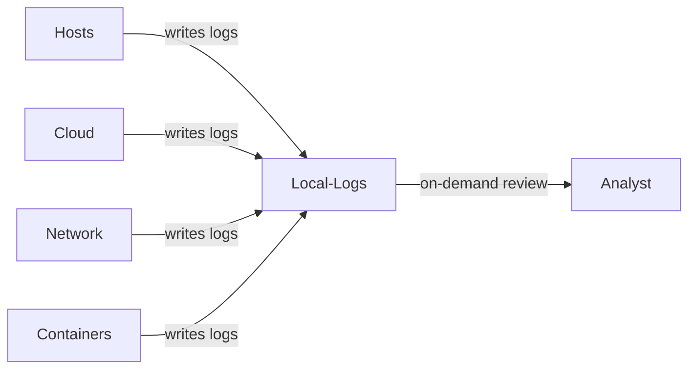
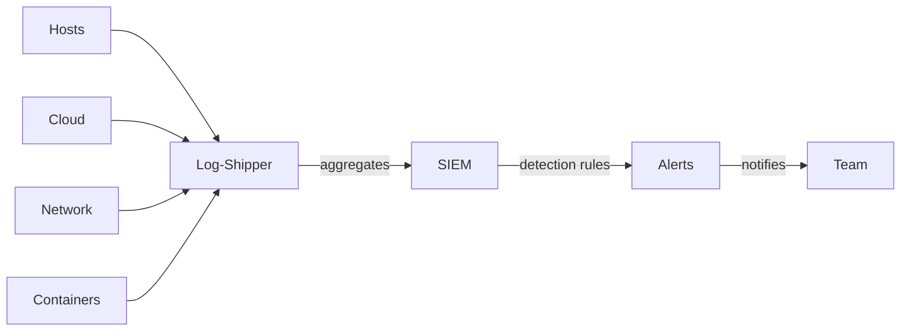
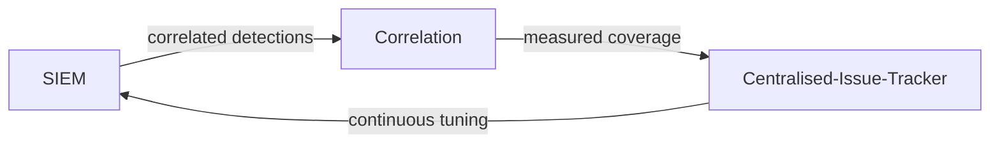

# 環境セキュリティログ記録 (Environment Security Logging)

| ID            |
| ------------- |
| DSOVS-OPR-003 |

## 概要

環境セキュリティログ記録は環境のセキュリティ構成に加えられたあらゆる変更を追跡し、ログ記録する方法です。

これにはファイアウォールルールの変更から、ユーザーアカウントの作成や削除まで、あらゆるものが含まれます。

悪意のあるアクターに悪用される前に、環境のセキュリティ脆弱性や潜在的な脅威を特定するのに役立つため、これは DevSecOps の重要な部分です。

システム変更の包括的なログを保持することで、DevSecOps チームは疑わしいアクティビティや異常に迅速に対応できます。さらに、必要なセキュリティ対策がすべて講じられていることを確認するために、環境セキュリティログ記録はコンプライアンス要件に役立ちます。

## レベル 0 - セキュリティイベントのログを一元管理していない

At this level of maturity the environment produces little or no security telemetry, and whatever logs do exist are scattered across individual hosts, cloud accounts and network devices without any consistent collection. Operating system audit trails, cloud control-plane events, firewall and load-balancer records, and container runtime activity are either disabled or left in their local defaults.

Because nothing is gathered in a common place, investigating an incident means logging into machines one at a time and hoping the relevant records have not already rotated away. There is no reliable way to reconstruct who changed a security group, created a privileged account, or restarted a workload, which leaves the team effectively blind to malicious or accidental changes in the environment.

## レベル 1 - 環境セキュリティイベントを一元管理された場所にログ記録し、監視している

At level one the important sources of environment telemetry are switched on and their logs are deliberately captured. Host-level audit logs, cloud provider audit trails such as CloudTrail or Activity Log, VPC and network flow logs, and container runtime events are retained rather than discarded, so the raw material needed to answer security questions exists.

Review of these logs, however, is still largely manual and reactive. Engineers query the logs on demand, usually after an alert from another system or during an incident or audit, rather than as part of a continuous process. The data is available and trustworthy enough to support an investigation, but coverage gaps and the human effort involved mean that suspicious activity can sit unnoticed until someone goes looking for it.



## レベル 2 - 不正使用や異常に対して開発チームへの警告や通知を実装している

At level two the captured telemetry is shipped to a central platform, typically a SIEM or equivalent log analytics stack, where events from across hosts, cloud accounts, network and container layers are normalised and stored together. With everything in one place the team can write detection rules and dashboards that watch for known-bad patterns such as disabled audit logging, new privileged identities, security-group changes opening sensitive ports, or unexpected outbound connections from a workload.

Crucially, these detections are wired to notifications so that the right development or operations team is alerted automatically when an anomaly or abuse pattern fires, instead of relying on someone happening to inspect a dashboard. The shift from on-demand review to automated, near-real-time alerting is what distinguishes this level: the environment now actively surfaces issues rather than merely recording them.



## レベル 3 - 開発チームは環境セキュリティイベントを監視し分析する能力を持っている

At level three logging is treated as an engineered, continuously improving capability. Detections are correlated across multiple sources so that a single suspicious sequence, for example an unusual cloud API call followed by a container spawning an unexpected process, is recognised as one incident rather than a handful of disconnected alerts. Coverage is measured against the environment's assets so the team can demonstrate which systems, accounts and event types are actually being collected, and can close gaps deliberately.

Retention and integrity controls underpin the whole pipeline: logs are kept for a defined period to satisfy investigation and compliance needs, and they are protected from tampering through write-once storage, access controls and integrity checks so that an attacker cannot quietly erase their tracks. Finally, the detection content is tuned on an ongoing basis, with noisy rules refined, new threats modelled, and effectiveness reviewed, so that signal-to-noise improves over time and the team retains genuine, analyst-ready visibility into the security state of the environment.



# Notable Tools

⚠️ **Disclaimer**

Apart from official OWASP Projects, the tools in this section have been chosen on the basis of their proven capabilities alone and there is no other relationship between the DSOVS project leaders and the creators or vendors who maintain them. 

If you have a suggestion for a notable tool please [💡 Suggest a Tool](https://github.com/OWASP/www-project-devsecops-verification-standard/discussions/categories/ideas) 

## [Wazuh](https://github.com/wazuh/wazuh)

Wazuh is an open source security platform that unifies host-based intrusion detection, log analysis, file integrity monitoring and cloud security monitoring. Agents collect operating system and application telemetry, evaluate it against a rule set, and forward matches to a central manager, making it a practical foundation for centralised environment logging with alerting and compliance mapping.

```yaml
# Wazuh rule: alert when an audit log is cleared on a monitored host
<group name="audit,integrity_monitoring,">
  <rule id="100200" level="12">
    <if_sid>80700</if_sid>
    <field name="audit.command">auditctl</field>
    <description>Audit configuration was modified on $(agent.name)</description>
    <mitre>
      <id>T1562.001</id>
    </mitre>
  </rule>
</group>
```

## [Falco](https://github.com/falcosecurity/falco)

Falco is a CNCF runtime security project that watches kernel-level system calls (and Kubernetes audit events) to detect anomalous behaviour inside containers and on hosts in real time. It ships with a maintained rule set and emits structured alerts that integrate cleanly with downstream SIEM and notification pipelines.

```yaml
# Falco rule: detect a shell spawned inside a container
- rule: Terminal shell in container
  desc: A shell was used as the entrypoint/exec in a container
  condition: >
    spawned_process and container
    and shell_procs and proc.tty != 0
  output: >
    Shell spawned in container (user=%user.name container=%container.id
    image=%container.image.repository proc=%proc.cmdline)
  priority: WARNING
  tags: [container, shell, mitre_execution]
```

## [Elastic Stack / OpenSearch](https://github.com/opensearch-project/OpenSearch)

The Elastic Stack and its open source fork OpenSearch provide the aggregation, search and visualisation layer that ties host, cloud, network and container telemetry together. Beats and Logstash (or the OpenSearch equivalents) ship and parse logs into a central store, while the bundled SIEM/security analytics features add correlation rules, dashboards and alerting on top of the indexed data.

## References

- [OWASP SAMM - Operational Management](https://owaspsamm.org/model/operations/operational-management/)
- [MITRE ATT&CK](https://attack.mitre.org/)
- [CIS Benchmarks](https://www.cisecurity.org/cis-benchmarks)
