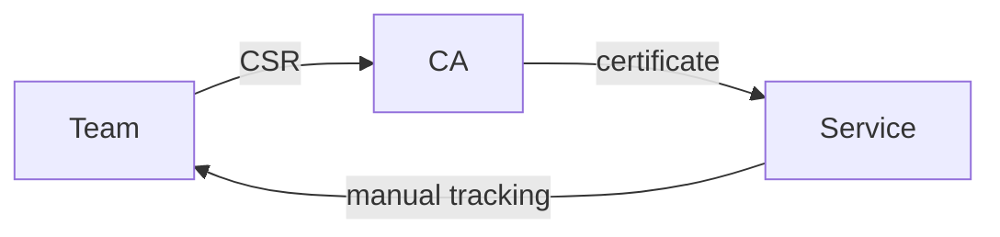
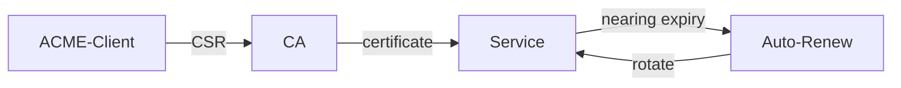
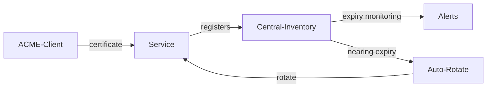

# 証明書管理 (Certificate Management)

| ID            |
| ------------- |
| DSOVS-OPR-006 |

## 概要

証明書管理はウェブサイト、アプリケーション、その他のシステムで使用される証明書と秘密鍵を作成、保存、管理するプロセスです。

これらのデジタル証明書はブラウザとウェブサイト間のセキュアな通信を可能にするものであり、証明書には公開鍵や秘密鍵やデジタル署名などの重要な情報が含まれています。

アプリケーションとサーバー間のセキュアな通信を保証し、通信するエンティティの身元を検証することで悪意のあるアクティビティを防止するため、証明書管理は DevSecOps の重要な部分となっています。

さらに、顧客を認証するためのセキュアな方法を提供し、認可されたユーザーのみが機密データにアクセスできるようにします。

## レベル 0 - 開発チーム以外で指名された役割またはチームが証明書ライフサイクル管理タスクを実施している

At this level, responsibility for the certificate life cycle sits with a separate role or team outside of the development team, and the work is handled manually and reactively. Certificates are issued, renewed and replaced on request, often through a ticket or email to a central operations or networking function, with no shared inventory that the development team can see or act on.

Because the people running the services are not the people managing the certificates, knowledge is fragmented and renewals depend on individuals remembering deadlines. The common failure modes are predictable: expired certificates that cause sudden outages, weak or outdated cryptography that goes unnoticed, and private keys handled inconsistently. There is no systematic visibility into what certificates exist, where they are deployed, or when they expire.

## レベル 1 - 開発チームが PKI 証明書の全サイクル管理を実施している

At Level 1, ownership of the full certificate life cycle moves to the development team that runs the service, so the people who understand the application are also the ones issuing, deploying, rotating and revoking its certificates. This removes the hand-off delays of the previous level and lets renewals be planned alongside normal release work.

The team uses on-demand tooling to generate certificate signing requests, request certificates from a certificate authority, and install them where they are needed. The process is still largely human-driven and triggered when someone notices an upcoming expiry or a new endpoint, but accountability is now clear and the team can choose appropriate key sizes and signature algorithms rather than inheriting whatever a remote team configured. This shortens the feedback loop and reduces the chance of a certificate being forgotten, even though it does not yet remove the manual effort.



## レベル 2 - 自動 PKI ライフサイクル管理を実装している

Level 2 replaces the manual, on-demand work with automated PKI life-cycle management. Certificate issuance and renewal are driven by tooling that requests, validates, installs and rotates certificates without human intervention, typically through a protocol such as ACME and a controller that watches for certificates approaching expiry and renews them well in advance.

Because renewal is continuous and automatic, the entire class of expiry-related outages is largely designed out, and rotating certificates frequently becomes practical rather than painful. Automation also enforces consistency: every certificate is issued with approved key types, algorithms and validity periods, private keys are generated and stored in a controlled way, and short-lived certificates can be adopted safely. This is a clear improvement over Level 1, where strong practices depended on the team remembering to apply them each time.



## レベル 3 - エンドツーエンドのセキュア通信を実装している

At Level 3, automated certificate management is extended into a centralised, measured capability that underpins end-to-end secure communication across the estate. Every certificate, whether protecting an external endpoint or internal service-to-service traffic, is tracked in a central inventory that records its issuer, key parameters, deployment location and expiry, giving a single source of truth across teams.

This central view is actively monitored and measured. Dashboards and alerts surface upcoming expiries, weak or non-compliant cryptography and certificates issued outside policy, and these signals feed into the same tracking and reporting used for other security findings. The configuration and effectiveness of the certificate management programme are reviewed periodically so that algorithms, validity periods and automation coverage are tightened over time. The result is encrypted communication along the full path between components, continuously verified rather than assumed, building on the automation of Level 2 with oversight, metrics and continuous improvement.



# Notable Tools 

⚠️ **Disclaimer**

Apart from official OWASP Projects, the tools in this section have been chosen on the basis of their proven capabilities alone and there is no other relationship between the DSOVS project leaders and the creators or vendors who maintain them. 

If you have a suggestion for a notable tool please [💡 Suggest a Tool](https://github.com/OWASP/www-project-devsecops-verification-standard/discussions/categories/ideas) 

## [cert-manager](https://github.com/cert-manager/cert-manager)

cert-manager is a Kubernetes controller that automates the issuance, renewal and rotation of TLS certificates from sources such as Let's Encrypt, HashiCorp Vault and private PKIs. It models certificates as native Kubernetes resources, watches them for expiry, and renews them automatically before they lapse, removing manual life-cycle work for workloads running on a cluster.

The example below defines an ACME `ClusterIssuer` backed by Let's Encrypt and a `Certificate` that cert-manager keeps valid and stores in the named secret.

```yaml
apiVersion: cert-manager.io/v1
kind: ClusterIssuer
metadata:
  name: letsencrypt-prod
spec:
  acme:
    server: https://acme-v02.api.letsencrypt.org/directory
    email: security@example.com
    privateKeySecretRef:
      name: letsencrypt-prod-account-key
    solvers:
      - http01:
          ingress:
            ingressClassName: nginx
---
apiVersion: cert-manager.io/v1
kind: Certificate
metadata:
  name: example-com-tls
  namespace: web
spec:
  secretName: example-com-tls
  duration: 2160h    # 90 days
  renewBefore: 360h  # rotate 15 days before expiry
  privateKey:
    algorithm: ECDSA
    size: 256
  dnsNames:
    - example.com
    - www.example.com
  issuerRef:
    name: letsencrypt-prod
    kind: ClusterIssuer
    group: cert-manager.io
```

## [Certbot / Let's Encrypt ACME](https://github.com/certbot/certbot)

Certbot is the EFF's reference ACME client for obtaining and renewing free, automated certificates from Let's Encrypt. It is well suited to traditional virtual machines and standalone web servers, where it can configure popular web servers directly and install a renewal timer so certificates are rotated before they expire.

The command below issues a certificate for one or more domains and installs an automatic renewal job; `certbot renew` is then run on a schedule (typically twice daily) to rotate certificates as they approach expiry.

```bash
# Obtain and install a certificate for nginx, agreeing to the ACME terms
certbot --nginx \
  -d example.com -d www.example.com \
  --agree-tos -m security@example.com --non-interactive

# Test the automatic renewal that certbot schedules (rotates near expiry)
certbot renew --dry-run
```

## 参考情報
