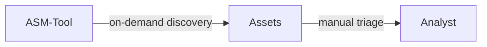
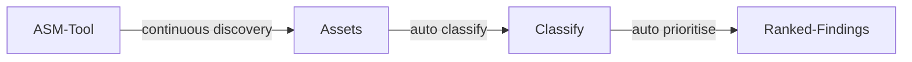
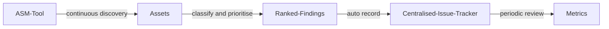

# 攻撃対象領域管理 (Attack Surface Management)

| ID            |
| ------------- |
| DSOVS-OPR-007 |

## 概要

攻撃対象領域管理 (ASM) ソリューションとツールはソフトウェア、ハードウェア、ネットワークなど、組織のデジタルインフラストラクチャに存在する脆弱性を特定、追跡、管理するために使用されます。

ASM の目標はサイバー犯罪者に悪用される可能性のあるデジタルインフラストラクチャ内のすべてのポイントの合計である、組織の全体的な攻撃対象領域を減らすことです。攻撃対象領域を減らすことで、組織はサイバー攻撃から身を守り、侵害が成功するリスクを軽減できます。

ASM ソリューションとツールは一般的に組織のデジタル資産を包括的に閲覧できます。隠されているものや忘れられているものも含みます。また、ソフトウェア、システム、ネットワークの脆弱性や設定ミスを特定します。これらは攻撃者が不正アクセスや損害を与えるために使用される可能性があります。

組織のサイバーセキュリティのための ASM ソリューションとツールの利点には以下のようなものがあります。

1. 可視性の向上: ASM ソリューションは組織のデジタル資産を包括的に閲覧できるため、システムに存在するセキュリティリスクと脆弱性の可視性と理解を向上します。

2. プロアクティブアプローチ: ASM ソリューションによりサイバー犯罪者に悪用される前に脆弱性を特定し対処することで、組織はセキュリティへのプロアクティブなアプローチをとることができます。

3. 脅威インテリジェンスの強化: ASM ツールは最新の脅威と脆弱性を追跡することで貴重な脅威インテリジェンスを提供し、組織は最も重大なリスクに優先順位を付けて対処できます。

4. コンプライアンス: ASM ソリューションは組織が一般データ保護規則 (GDPR) やペイメントカード業界データセキュリティ基準 (PCI DSS) などのさまざまな規制要件や標準規格への準拠を支援します。

5. コスト削減: ASM ソリューションは脆弱性に対処し、攻撃が成功する可能性を減らすことで、組織がデータ侵害やサイバー攻撃に関連するコストの削減を支援します。

全体としては、ASM ソリューションとツールは組織の強力なサイバーセキュリティ態勢を維持し、可視性の向上、プロアクティブアプローチ、脅威インテリジェンスの強化、コンプライアンス、コスト削減を提供するために不可欠です。

## レベル 0 - 組織のIT資産のセキュリティをリアルタイムで発見、分類、評価、監視するためのツールがない

At this level there is no tooling to discover, classify, assess or monitor the organisation's internet-facing assets. Whatever inventory exists is manual and quickly goes stale, captured in spreadsheets or tribal knowledge rather than derived from what is actually exposed.

As a result the organisation has no reliable picture of its true attack surface. Forgotten subdomains, shadow IT, abandoned cloud instances and newly exposed services accumulate unseen, and any one of them can become an entry point that defenders are unaware of. Without continuous visibility, exposures are typically only discovered after an incident or an external report.

## レベル 1 - 組織のIT資産のセキュリティを継続的に発見、分類、評価、監視するツールを使用している

At Level 1 a dedicated tool is introduced to discover and enumerate the organisation's external assets, replacing manual record-keeping with active reconnaissance. Subdomains, hosts, open ports and exposed services are identified by the tool, giving a far more accurate and current view of what is reachable from the internet than any hand-maintained list.

The tool is run regularly and can be scheduled to refresh the inventory on an ongoing basis, so newly stood-up or decommissioned assets are reflected over time. The emphasis here is on visibility and coverage: the organisation now knows what it has exposed and can assess and monitor those assets, even if triage of the results still relies largely on human judgement.



## レベル 2 - 発見された組織のIT資産が適切に分類され、特定された実現可能性のある攻撃ベクトルを自動的に優先順位付けしている

Level 2 builds on continuous discovery by adding automated classification and prioritisation. Discovered assets are enriched and categorised, for example by technology, ownership or business criticality, and the tooling automatically probes them for misconfigurations, exposed services and known vulnerabilities, turning a raw inventory into an actionable view of attack vectors.

Rather than presenting every finding with equal weight, the pipeline ranks possible attack vectors so that the most serious exposures rise to the top. This continuous, automated flow means new assets are assessed as soon as they appear and the highest-risk issues are surfaced for attention first, a clear advance over Level 1 where discovery existed but interpretation and prioritisation were manual.



## レベル 3 - 発見された内容が一元管理された課題追跡システムに自動的に記録されており、ツールの有効性を定期的にレビューしている

At Level 3 the attack surface management process is the same continuous, automated and prioritised pipeline as Level 2, with the addition that findings are automatically recorded into a centralised issue tracking system. Each exposure becomes a tracked item that can be assigned, remediated and verified alongside other security work, ensuring nothing discovered is quietly lost.

Because findings are centralised, the programme can be measured: metrics such as time to remediate, recurrence of exposures and coverage of the known estate become visible and reportable. The effectiveness of the tooling and process is reviewed periodically, with detection rules, scoping and prioritisation tuned in response to what the data shows. This closes the loop from discovery through remediation to continuous improvement.



# Notable Tools 

⚠️ **Disclaimer**

Apart from official OWASP Projects, the tools in this section have been chosen on the basis of their proven capabilities alone and there is no other relationship between the DSOVS project leaders and the creators or vendors who maintain them. 

If you have a suggestion for a notable tool please [💡 Suggest a Tool](https://github.com/OWASP/www-project-devsecops-verification-standard/discussions/categories/ideas) 

## [OWASP Amass](https://github.com/owasp-amass/amass)

The OWASP Amass project performs in-depth attack surface mapping and external asset discovery. It combines passive sources, DNS enumeration and active reconnaissance to discover subdomains, hosts and related infrastructure, making it well suited to continuously building and refreshing an inventory of what an organisation exposes on the internet.

Running Amass on a schedule lets you track how the external footprint of a domain changes over time and feed the results into downstream assessment.

```bash
# Enumerate subdomains and associated assets for a target domain
amass enum -d example.com -o amass-example.txt

# Compare results between runs to detect newly exposed assets
amass enum -d example.com -json results.jsonl
```

## [Nuclei](https://github.com/projectdiscovery/nuclei)

Nuclei is a fast, template-driven scanner that checks targets for misconfigurations, exposed services and known vulnerabilities using a large, community-maintained template library. Pointed at the assets discovered during attack surface mapping, it automates the assessment and prioritisation step by reporting findings with severity, making it a natural fit for continuous external monitoring.

The workflow below runs Nuclei on a schedule so that the known attack surface is re-checked regularly and new exposures are surfaced automatically.

<a href="https://github.com/projectdiscovery/nuclei-action"> GitHub Actions

```yaml
name: nuclei-scan
on:
  workflow_dispatch:
  schedule:
    - cron: "0 4 * * *" # run once a day at 4 AM
jobs:
  scan:
    name: nuclei
    runs-on: ubuntu-latest
    steps:
      - uses: actions/checkout@v4
      - name: Run Nuclei
        uses: projectdiscovery/nuclei-action@main
        with:
          target: https://example.com
          flags: "-severity critical,high,medium"
```

## 参考情報
