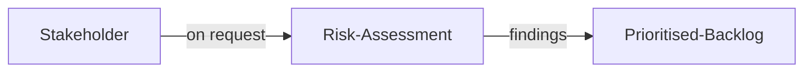
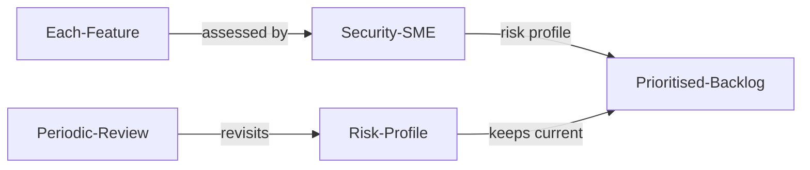

# リスク評価 (Risk Assessment)

| ID            |
| ------------- |
| DSOVS-ORG-001 |

## 概要

リスク評価は組織、プロジェクト、システム、ビジネスプロセスに関連し、その成功に影響を及ぼす可能性のあるリスクを分析するプロセスです。

これはシステムやプロセスのセキュリティとパフォーマンスに影響を与える可能性のある潜在的な脆弱性や脅威を特定するのに役立つため、DevSecOps の重要な部分となっています。

リスク評価によって組織はより優れたセキュリティプラクティスを開発し、改善作業に優先順位を付け、問題になる前に潜在的なリスクをプロアクティブに対処できます。

## レベル 0 - リスク評価活動を実施していない

組織がそのプロジェクト、システム、ビジネスプロセスにわたって、何らかの形でリスク評価を実施しているという証拠はありません。潜在的な脆弱性や脅威が特定や分析されていないため、機能やアーキテクチャに関する決定は、それがもたらすセキュリティリスクの体系的な理解なしで下されています。結果として、組織は是正措置に優先順位付けたり、問題が顕在化する前に予測することができません。

## レベル 1 - 要求に応じてリスク評価業務を実施している

Risk assessment is carried out only on an ad-hoc basis, typically in response to a specific request, a notable incident, or a particular concern raised by a stakeholder. While these exercises can surface useful insights, they are reactive and inconsistent, and there is no guarantee that every feature or change receives the same scrutiny. Because the activity depends on someone asking for it, significant risks can go unexamined whenever a request is not made.

## レベル 2 - ソフトウェア開発チーム内のセキュリティ分野の専門家が各機能のリスク評価を実施している

A security subject matter expert embedded within the software development team assesses the risk of each feature as it is designed and built. This brings security analysis directly into the development workflow, allowing threats and vulnerabilities to be considered consistently for every change rather than only when prompted. The expert's involvement helps the team weigh design decisions against their security implications early, so that remediation can be prioritised before features are released.

## レベル 3 - 定期的なレビュースケジュールを定め、開発チームがリスクプロファイルをレビューしている

In addition to assessing individual features, the development team follows a defined, periodic schedule to review the overall risk profile and keep it current as the system, its dependencies, and the threat landscape evolve. Each review revisits previously accepted risks and confirms whether earlier decisions remain valid. Risk decisions are recorded and tracked over time, giving the organisation a clear, auditable view of how its risk posture is changing and where attention is needed next.

## Further reading

### Risk assessment tools
- https://evaluator.tidyrisk.org/

### Risk assessment resources
- **NIST - Secure Software Development Framework  (SSDF)**
The Secure Software Development Framework (SSDF) is a set of fundamental, sound, and secure software development practices based on established secure software development practice documents from organizations such as  [BSA](https://www.bsa.org/),  [OWASP](https://owasp.org/), and  [SAFECode](https://safecode.org/). Few software development life cycle (SDLC) models explicitly address software security in detail, so practices like those in the SSDF need to be added to and integrated with each SDLC implementation.
	- https://csrc.nist.gov/Projects/ssdf

- **Synopsys**
A practitioner-oriented overview of software risk analysis that explains how to identify, assess, and prioritise security risks throughout the software development life cycle.
	-	https://www.synopsys.com/blogs/software-security/software-risk-analysis/

- **OWASP Risk Rating Methodology**
A structured approach for estimating the severity of security risks by scoring the likelihood and impact of each issue, helping teams rank and prioritise remediation consistently.
	- https://owasp.org/www-community/OWASP_Risk_Rating_Methodology
