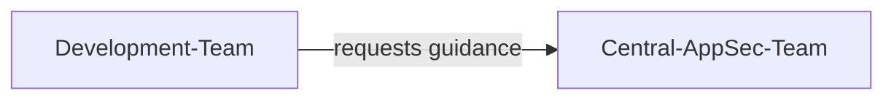
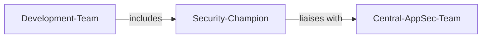
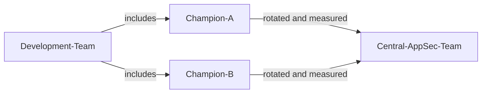

# セキュリティ担当者 (Security Champion)

| ID            |
| ------------- |
| DSOVS-ORG-003 |

## 概要

セキュリティ担当者は組織内でセキュリティプラクティスを推進および実施する役割を担う個人またはチームです。

セキュリティ担当者には製品、サービス、アプリケーションの開発およびデプロイメントプロセス全体を通してセキュリティが考慮されるようにする責任があります。

セキュリティ担当者は DevSecOps で重要な役割を果たします。セキュリティが DevOps プロセスおよびツールに統合されていることを確認し、組織がセキュリティ目標を達成できるように支援します。

また、セキュリティチームと DevOps チームの橋渡し役として機能し、セキュリティの重要性を伝え、セキュリティが組み込まれることを提唱します。

セキュリティ担当者は組織の DevSecOps の取り組みが効果的であり、実際の成果をもたらすことを助けます。

## レベル 0 - 組織にはアプリケーションセキュリティ能力がない

The organisation has no recognised application security capability and no individuals tasked with advocating for secure development practices. Security knowledge is not consciously cultivated within the engineering teams, and there is no point of contact who can answer security questions or guide design and implementation decisions. As a result, security considerations depend entirely on the incidental experience of individual developers rather than any deliberate organisational function.

## レベル 1 - 一元管理されたアプリケーションセキュリティ機能や能力が存在し、対象分野の専門知識を提供している

A central application security function or team has been established to provide subject matter expertise to the wider organisation. Development teams can reach out to this group for guidance on threats, secure design, and remediation, which gives the organisation a consistent and authoritative source of security knowledge. While this represents a meaningful improvement over having no capability at all, the expertise remains concentrated in a single team and is delivered on request, so coverage across individual development teams is uneven and reactive rather than embedded in day-to-day delivery.

## レベル 2 - 各開発チーム内で活動する専任のセキュリティ担当者を任命している

The organisation has moved security expertise closer to where software is built by appointing a dedicated security champion within each development team. These champions are embedded developers who advocate for security inside their own teams, act as the first point of contact for security questions, and create a direct link back to the central application security function. Because every team now has a named individual responsible for promoting secure practices, security guidance is applied more consistently and earlier in the lifecycle, and issues are increasingly identified by the teams themselves rather than only during centralised review.

## レベル 3 - 複数のセキュリティ分野の専門家集団が開発チーム内で担当者になっている

Security expertise has matured to the point where multiple subject matter experts within a team are capable of acting as the security champion, removing reliance on any single person. The champion role is supported, rotated, and measured, with the organisation actively developing the depth of its security talent and tracking the effectiveness of the programme. This redundancy and ongoing investment make the security champion capability resilient and continuously improving, allowing the organisation to scale secure development practices as teams grow and to refine the programme in line with its evolving risk profile.

## Further reading
- [OWASP Security Culture Project](https://owasp.org/www-project-security-culture/) - Guidance on building a security culture, including how to establish and run a security champions programme.
- [OWASP Security Champions Playbook](https://github.com/c0rdis/security-champions-playbook) - A practical, step-by-step playbook for identifying, nominating, and supporting security champions within development teams.
- [OWASP SAMM - Education & Guidance](https://owaspsamm.org/model/governance/education-and-guidance/) - The SAMM governance practice covering how organisations grow security knowledge and embedded expertise such as champions.
