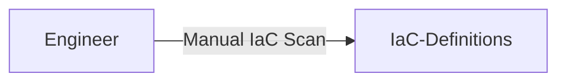
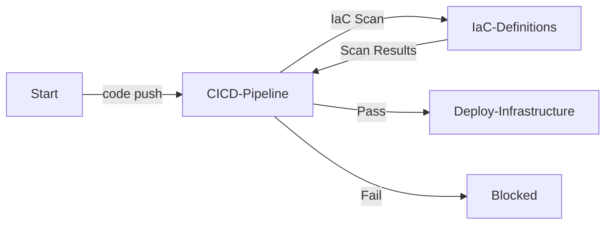
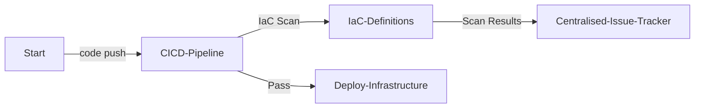

# Infrastructure-as-Code (IaC) セキュアデプロイメント (Infrastructure-as-Code (IaC) Secure Deployment)

| ID            |
| ------------- |
| DSOVS-REL-006 |

## 概要

Infrastructure-as-Code (IaC) スキャンはクラウドインフラストラクチャのために書かれたソースコードに対してセキュリティスキャンを実行するプロセスです。

これは悪意のあるアクターによって悪用される可能性のあるコードの潜在的な脆弱性や弱点を検出するために使用されます。スキャンは自動化されたツールを使用して実行され、セキュアではないクレデンシャル、セキュアではないコンフィグレーション、その他のセキュリティコンフィグレーションのミスなどの一般的な問題を探します。

コードがデプロイされる前にセキュアであることを確認するのに役立ち、組織がクラウドインフラストラクチャに関連するリスクを最小限に抑えることができるようになるため、DevSecOps の重要な部分です。

## レベル 0 - インフラストラクチャプロビジョニングを手動で実施している、またはバージョン管理をしていない

At this level of security maturity, there is no tooling in place to security-scan Infrastructure-as-Code before it is deployed. Infrastructure may be provisioned manually through cloud consoles or applied directly from configuration files that are never assessed for misconfigurations, meaning that insecure defaults, overly permissive access policies and exposed credentials can reach production entirely unchecked.

## レベル 1 - インフラストラクチャコンフィグレーションファイルをバージョン管理し、リリース自動プロセスを実施している

At this stage an IaC security scanner is available and is run against the infrastructure definitions, but only on a case-by-case basis. A developer or engineer typically invokes the tool manually against their Terraform, CloudFormation or Kubernetes manifests before a release, and the results may not be reported, recorded or acted upon in any consistent way. Coverage therefore depends entirely on individual discipline rather than on any enforced process.



## レベル 2 - インフラストラクチャの変更をデプロイメントする際に最小権限の原則を実装している

Here, IaC security scanning is integrated directly into the build pipeline. Whenever infrastructure code is pushed, an automated scan is triggered against the Terraform, CloudFormation or Kubernetes manifests and the findings are reported back to the build. Crucially, the scan acts as a gate: a definition that contains high-severity misconfigurations causes the pipeline to fail, blocking the insecure deployment before any resources are provisioned. This ensures that misconfigurations such as public storage buckets, unencrypted volumes or overly broad IAM permissions are caught consistently rather than relying on manual review.



## レベル 3 - インフラストラクチャの変更をデプロイメントするプロセスの一環として認可のチェーンを実装している

Level 3 builds on Level 2 by automatically recording every identified misconfiguration in a centralised issue tracking system, where findings can be triaged, assigned and trended over time. The effectiveness of the IaC scanning is periodically reviewed so that rule sets, baselines and severity thresholds can be tuned, false positives suppressed and emerging misconfiguration patterns addressed. More mature organisations also provide teams with shared, organisation-specific policy packs and example CI/CD templates, making consistent IaC scanning easy to adopt across every project.



# Notable Tools 

⚠️ **Disclaimer**

Apart from official OWASP Projects, the tools in this section have been chosen on the basis of their proven capabilities alone and there is no other relationship between the DSOVS project leaders and the creators or vendors who maintain them. 

If you have a suggestion for a notable tool please [💡 Suggest a Tool](https://github.com/OWASP/www-project-devsecops-verification-standard/discussions/categories/ideas) 

## [Checkov](https://github.com/bridgecrewio/checkov)

Checkov is an open-source static analysis tool for Infrastructure-as-Code. It scans Terraform, CloudFormation, Kubernetes, Helm, ARM templates and Serverless framework definitions against thousands of built-in policies to surface misconfigurations and compliance issues before deployment. Findings can be output as SARIF for native integration with code-scanning dashboards.

<a href="https://github.com/bridgecrewio/checkov-action"> GitHub Actions

```
name: checkov
on:
  push:
  pull_request:
  workflow_dispatch:

jobs:
  scan:
    runs-on: ubuntu-latest
    permissions:
      security-events: write
    steps:
      - uses: actions/checkout@v4

      - name: Run Checkov
        uses: bridgecrewio/checkov-action@master
        with:
          directory: .
          framework: terraform
          output_format: sarif
          output_file_path: results.sarif

      - name: Upload results to GitHub Security
        uses: github/codeql-action/upload-sarif@v3
        with:
          sarif_file: results.sarif
```

<a href="https://www.checkov.io/4.Integrations/GitLab%20CI.html"> GitLab CI

```
stages:
  - iac-scan

checkov:
  stage: iac-scan
  image:
    name: bridgecrew/checkov:latest
    entrypoint: [""]
  script:
    - checkov --directory . --output junitxml | tee checkov.test.xml
  artifacts:
    reports:
      junit: checkov.test.xml
    paths:
      - checkov.test.xml
```

## [tfsec / Trivy config](https://github.com/aquasecurity/tfsec)

tfsec is a fast static analysis scanner for Terraform that highlights potential misconfigurations and security issues with clear, actionable output. Its capabilities are now incorporated into [Trivy](https://github.com/aquasecurity/trivy), which extends configuration scanning across Terraform, CloudFormation, Kubernetes, Helm and Dockerfiles alongside its vulnerability scanning, making it a convenient single tool for IaC security checks in the pipeline.

<a href="https://github.com/aquasecurity/tfsec-action"> GitHub Actions

```
name: tfsec
on:
  push:
  pull_request:

jobs:
  tfsec:
    runs-on: ubuntu-latest
    steps:
      - uses: actions/checkout@v4

      - name: Run tfsec
        uses: aquasecurity/tfsec-action@v1.0.3
        with:
          working_directory: .
```

<a href="https://aquasecurity.github.io/trivy/latest/docs/coverage/iac/"> GitLab CI

```
stages:
  - iac-scan

trivy-config:
  stage: iac-scan
  image:
    name: aquasec/trivy:latest
    entrypoint: [""]
  script:
    - trivy config --exit-code 1 --severity HIGH,CRITICAL --format table .
```

## 参考情報
