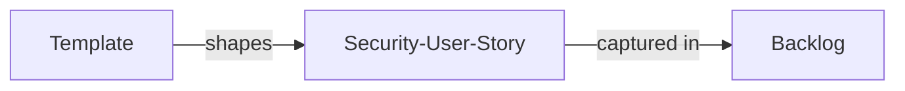
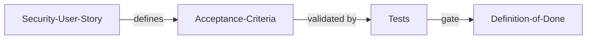
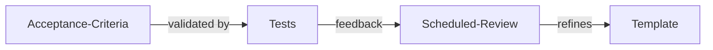

# セキュリティユーザーストーリーと受け入れ基準 (Security User Stories and Acceptance Criterias)

| ID            |
| ------------- |
| DSOVS-REQ-003 |

## 概要

セキュリティユーザーストーリーと受け入れ基準はソフトウェア開発プロセスにセキュリティが後付けではなく最初から組み込まれていることを確認するための方法です。They translate security requirements into the same language the team already uses to plan and deliver features.

Security user stories help developers understand what protective behaviour an application must exhibit, while abuse or misuse cases describe how an attacker might subvert a feature. Acceptance criteria then give both developers and testers a concrete, testable definition of "done" for those security needs.

By capturing security expectations as stories and acceptance criteria, teams can be confident that an application meets a minimum security baseline and that flaws are surfaced and fixed during development rather than after release.

This is an important part of DevSecOps because it keeps security visible in the backlog, makes it a shared responsibility of the whole team, and helps demonstrate that regulatory and compliance obligations are being met.

## レベル 0 - セキュリティユーザーストーリーや不正使用ストーリーテンプレートを定めていない

At this level there is no consistent way to capture security requirements as part of feature work. The backlog describes functional behaviour only, and any security considerations depend entirely on the knowledge and initiative of individual developers at the moment they happen to write code.

Because there is no template for security user stories or abuse cases, the team has no shared starting point for thinking about how a feature could be attacked or misused. Security requirements are therefore frequently overlooked, discovered late, or addressed inconsistently from one feature to the next.

## レベル 1 - セキュリティユーザーストーリーや不正使用ストーリーテンプレートを定めて使用している

The organisation has created a reusable template for security user stories and abuse or misuse cases, and teams have begun applying it to their work. This gives people a common structure and vocabulary for describing the protections a feature requires and the ways an adversary might attempt to defeat them.

Compared with Level 0, security is now expressed in artefacts that live alongside functional stories instead of relying purely on individual memory. Adoption may still be uneven and the depth of each story can vary, but the team has a deliberate, repeatable mechanism for surfacing security needs early in the requirements stage.

## レベル 2 - セキュリティユースケースやミスユースケースを機能の受け入れ基準として定めている

Security expectations are no longer captured only as standalone stories; they are written directly into the acceptance criteria that define when a feature is complete. Each relevant feature carries explicit, testable security conditions describing both the desired protective behaviour and the misuse scenarios that must be prevented.

This is a meaningful step up from Level 1 because security becomes a non-negotiable part of the definition of done rather than an optional supporting artefact. Developers know what they must build to pass, testers have unambiguous criteria to validate against, and a feature cannot be considered finished until its security acceptance criteria are demonstrably satisfied.

## レベル 3 - 定期的なレビュースケジュールを定め、開発チームがセキュリティユーザーストーリーテンプレートと受け入れ基準のスコープをレビューしている

The practice is now actively maintained through a defined, recurring review cycle. On a regular cadence the development team revisits the security user story template and the scope of the acceptance criteria to confirm they still reflect current threats, lessons learned from incidents, and changes to the application and its regulatory context.

This level builds on Level 2 by treating the security requirements process itself as something to be measured and continuously improved rather than left static. Feedback from testing results, vulnerabilities found in production, and evolving attack techniques is fed back into the templates, so the criteria stay relevant and the overall quality of security requirements steadily increases over time.

## Further reading
- https://owasp.org/www-project-application-security-verification-standard/ — OWASP ASVS provides a catalogue of verifiable security requirements that can be turned directly into security user stories and acceptance criteria.
- https://owaspsamm.org/model/design/security-requirements/ — OWASP SAMM Security Requirements practice describes how to build and improve security requirements (including misuse cases) within an agile lifecycle.
- https://owasp.org/www-community/Threat_Modeling — OWASP threat modeling guidance helps teams derive abuse and misuse cases that inform security stories.
- https://owasp.org/www-project-proactive-controls/ — OWASP Proactive Controls offers developer-focused security techniques that map well onto concrete acceptance criteria.
- https://owasp.org/www-pdf-archive/OWASP_Testing_Guide_v4.pdf — OWASP Testing Guide describes test approaches that acceptance criteria can reference to verify security behaviour.
