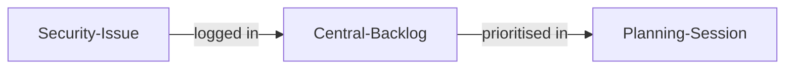
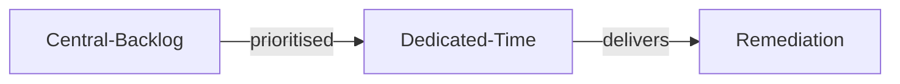
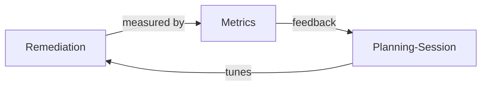

# セキュリティ課題の追跡 (Security Issues Tracking)

| ID            |
| ------------- |
| DSOVS-REQ-004 |

## 概要

Security issues tracking is focused on making sure that security defects and improvement work are managed with the same rigour and visibility as ordinary functional work. The objective is to ensure that vulnerabilities, weaknesses and remediation tasks are recorded, prioritised and resolved rather than lost or quietly deprioritised.

When security issues live in the same backlog and tooling the team already uses, they compete for attention alongside features and bugs, get scheduled in planning sessions, and remain visible to delivery and management. As the capability matures, the organisation moves from simply recording issues to dedicating time to fixing them and, ultimately, to measuring how quickly and how well security work is being completed.

## レベル 0 - セキュリティ課題は機能のバックログとは別に報告されている

At this level security issues are captured in a different place from the team's normal functional backlog, for example in spreadsheets, email threads, or standalone reports produced after an assessment. They are disconnected from the day-to-day planning the team actually uses to decide what to work on next.

Because these issues sit outside the main workflow, they are easily forgotten, rarely prioritised against feature work, and often go unaddressed. There is no single, reliable view of which security problems exist or who is responsible for resolving them.

## レベル 1 - セキュリティ課題は一元的に追跡管理し、計画セッションで優先順付けしている

Security issues are now recorded in a single, centralised tracking system, ideally the same issue tracker the team uses for functional work, so that nothing is scattered across disconnected reports. This gives the organisation one authoritative place to see what security problems are outstanding.

Crucially, these issues are brought into regular planning sessions and prioritised alongside other work. Compared with Level 0, security defects are no longer invisible to delivery; they are triaged, ranked by risk, and scheduled, which dramatically reduces the chance that important issues are simply lost.

## レベル 2 - セキュリティ修復や改善に関する開発チームの作業には事前に割り当てられた時間を費やしている

Beyond simply tracking and prioritising issues, the team now reserves capacity specifically for security remediation and improvement. A defined portion of each iteration or release cycle is set aside so that fixing vulnerabilities and hardening the application is a planned, expected activity rather than something squeezed in only when time allows.

This is an advance on Level 1 because prioritisation alone does not guarantee that security work actually gets done when feature pressure is high. By pre-allocating time, the organisation makes a deliberate, sustained commitment to working through the security backlog and prevents remediation from being perpetually deferred.

## レベル 3 - セキュリティ修復や改善の取り組みと速度を継続的に監視し測定している

At the highest level the organisation continuously measures how its security remediation is performing. Metrics such as time to remediate, the age and volume of open issues, and trends in recurring vulnerability types are tracked over time and reviewed to understand whether the process is keeping pace with incoming risk.

Building on the dedicated time established at Level 2, these measurements turn remediation into a managed, data-driven activity. The insights feed back into planning and process improvements, allowing the team to set and tune service-level targets, identify bottlenecks, and steadily improve both the speed and the quality of security fixes.

## Further reading
- https://github.com/DefectDojo/django-DefectDojo — OWASP DefectDojo is an open-source vulnerability management platform for centralising, deduplicating and tracking security findings.
- https://owaspsamm.org/model/implementation/defect-management/ — OWASP SAMM Defect Management practice describes how to track, prioritise and measure security defects across the lifecycle.
- https://csrc.nist.gov/Projects/ssdf — NIST Secure Software Development Framework (SSDF) sets out practices for identifying, tracking and remediating vulnerabilities throughout development.
- https://owasp.org/www-project-vulnerability-management-guide/ — OWASP Vulnerability Management Guide offers practical guidance on running an effective issue tracking and remediation process.
