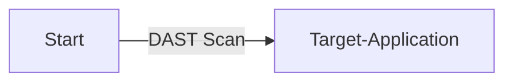
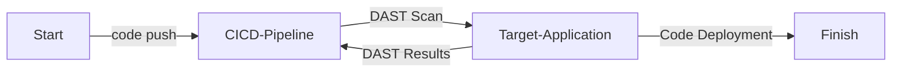
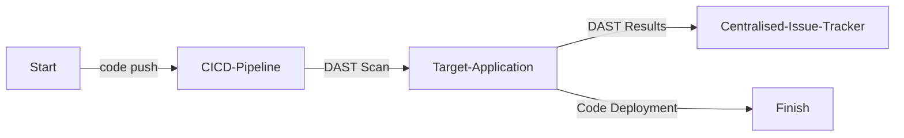

# 動的アプリケーションセキュリティテスト (Dynamic Application Security Testing, DAST)

| ID             |
| -------------- |
| DSOVS-TEST-002 |

## 概要

動的アプリケーションセキュリティテスト (DAST) は脆弱性を検出するために、アプリケーションの実行中にアプリケーションのセキュリティを解析します。

アプリケーションを評価し、アプリケーションの動作を調べて潜在的な問題を特定することに焦点を当てています。ソースコードを深く理解する必要はありません。

このタイプのテストは操作と動作によるものです。テスト担当者は使用中に発生する問題を探し、ソフトウェア設計の起源までさかのぼります。DAST は発展途上のプロジェクトにおける基本的なセキュリティや業界標準のコンプライアンスを満たすのに役立ちます。

## レベル 0 - 動的アプリケーションセキュリティテストを実施するためのツールがない

このレベルでのセキュリティ成熟度では、動的アプリケーションセキュリティ (DAST) スキャンを実行できるツールはありません。

## レベル 1 - オンデマンドスキャンを実行するツールを使用し、実行時にアプリケーション脆弱性を特定している

このステージでは、 DAST ツールが存在しますが、スキャンはケースバイケースで実行されます。自動化されておらず、結果は報告や記録されない場合があります。



## レベル 2 - ビルドパイプラインに動的アプリケーションセキュリティテストツールを実装し、自動スキャンを実行し、ビルドのステータスをレポートしている

ここでは、ソフトウェアビルドパイプラインに DAST スキャンが実装されています。つまり、ビルドが実行されるたびに、自動 DAST スキャンがトリガーされ、結果が報告されます。



## レベル 3 - 発見された内容が自動的に一元管理された課題追跡システムに記録されており、ツールの有効性を定期的にレビューしている

動的アプリケーションセキュリティ (DAST) のレベル 3 はレベル 2 と同じですが、特定されたすべてのセキュリティ脆弱性が一元管理された課題追跡システムに記録され、シークレット検出ツールの有効性を評価するために定期的にレビューされることが追加されています。つまり、同じタイプの自動スキャンが実行されていますが、将来の使用と改善のために結果が収集、追跡、分析されているのです。



# 注目すべきツール

⚠️ **免責事項**

OWASP の公式プロジェクトは別として、このセクションのツールはその実績のある機能のみに基づいて選択されており、DSOVS プロジェクトリーダーとそれらを保守する作成者やベンダーとの間には他の関係はありません。

注目すべきツールの提案がある場合には [💡 ツールを提案](https://github.com/OWASP/www-project-devsecops-verification-standard/discussions/categories/ideas) してください。

## [OWASP ZAP](https://github.com/zaproxy/zaproxy)

OWASP Zed Attack Proxy (ZAP) は世界で最も人気のあるフリーのセキュリティツールの一つであり、献身的な国際ボランティアチームによって活発にメンテナンスされています。アプリケーションを開発してテストする際に、ウェブアプリケーションのセキュリティ脆弱性を自動的に見つけるのに役立ちます。また、経験豊富なペンテスト担当者が手動でセキュリティテストを行う際に使用する優れたツールでもあります。

<a href="https://github.com/zaproxy/zaproxy"> GitHub Actions

```
on: [push]

jobs:
  zap_scan:
    runs-on: ubuntu-latest
    name: Scan the webapplication
    steps:
      - name: Checkout
        uses: actions/checkout@v2
        with:
          ref: master
      - name: ZAP Scan
        uses: zaproxy/action-baseline@v0.7.0
        with:
          token: ${{ secrets.GITHUB_TOKEN }}
          docker_name: 'owasp/zap2docker-stable'
          target: 'https://www.zaproxy.org'
          rules_file_name: '.zap/rules.tsv'
          cmd_options: '-a'
```

<a href="https://gitlab.com/gitlab-org/security-products/dependencies/zaproxy"> GitLab CI


```
dast:
  image: registry.gitlab.com/gitlab-org/security-products/zaproxy
  variables:
    website: "https://example.com"
  script:
    - mkdir /zap/wrk/
    - /zap/zap-baseline.py -J gl-dast-report.json -t $website || true
    - cp /zap/wrk/gl-dast-report.json .
  artifacts:
    paths: [gl-dast-report.json]

```

<a href="https://medium.com/adessoturkey/owasp-zap-security-tests-in-azure-devops-fe891f5402a4"> Azure DevOps

```
resources:
  repositories:
    - repository: <repo_name>
      type: git
      name: <project_name>/<repo_name>
      ref: refs/heads/master

trigger: none

stages:
- stage: 'buildstage'
  jobs:
  - job: 'buildjob'
    pool: 
      vmImage: 'ubuntu-latest'
    steps:
    - checkout: self
    - checkout: <repo_name>

    - bash: docker run -d -p <container_port>:<target_port> <your_image>
      displayName: 'App Container'

    - bash: |
        chmod -R 777  ./
        docker run --rm -v $(pwd):/zap/wrk/:rw -t owasp/zap2docker-stable zap-full-scan.py -t http://$(ip -f inet -o addr show docker0 | awk '{print $4}' | cut -d '/' -f 1):<container_port> -x 
xml_report.xml
        true
      displayName: 'Owasp Container Scan'

    - powershell: |
        $XslPath = "<repo_name>/xml_to_nunit.xslt" 
        $XmlInputPath = "xml_report.xml"
        $XmlOutputPath = "converted_report.xml"
        $XslTransform = New-Object System.Xml.Xsl.XslCompiledTransform
        $XslTransform.Load($XslPath)
        $XslTransform.Transform($XmlInputPath, $XmlOutputPath)
      displayName: 'PowerShell Script'
    - task: PublishTestResults@2
      displayName: 'Publish Test Results'
      inputs:
        testResultsFormat: 'NUnit'
        testResultsFiles: 'converted_report.xml'
```

## [Nuclei](https://github.com/projectdiscovery/nuclei)

Nuclei はテンプレートに基づいてターゲット全体にリクエストを送信するために使用され、誤検出をゼロにし、多数のホストで高速なスキャンを提供します。Nuclei は TCP, DNS, HTTP, SSL, File, Whois, Websocket, Headless などのさまざまなプロトコルのスキャンを提供します。強力で柔軟なテンプレートにより、Nuclei を使用してあらゆる種類のセキュリティチェックをモデル化できます。

<a href="https://github.com/projectdiscovery/nuclei-action"> GitHub Actions</a>

```
name: Nuclei - Vulnerability Scan

on:
    schedule:
      - cron: '0 0 * * *'
    workflow_dispatch:

jobs:
  nuclei-scan:
    runs-on: ubuntu-latest
    steps:
      - uses: actions/checkout@v2

      - name: Nuclei - Vulnerability Scan
        uses: projectdiscovery/nuclei-action@main
        with:
          target: https://example.com

      - name: GitHub Workflow artifacts
        uses: actions/upload-artifact@v2
        with:
          name: nuclei.log
          path: nuclei.log

      - name: GitHub Security Dashboard Alerts update
        uses: github/codeql-action/upload-sarif@v2
        with:
          sarif_file: nuclei.sarif
```

## 🙏 クレジット

コミュニティへの素晴らしい貢献なしにはこれを実現できませんでした。使用された外部からのインスピレーションに感謝の意を表します。

* [Manas Peçenek](https://www.linkedin.com/in/manas-pecenek-1812pr/)
